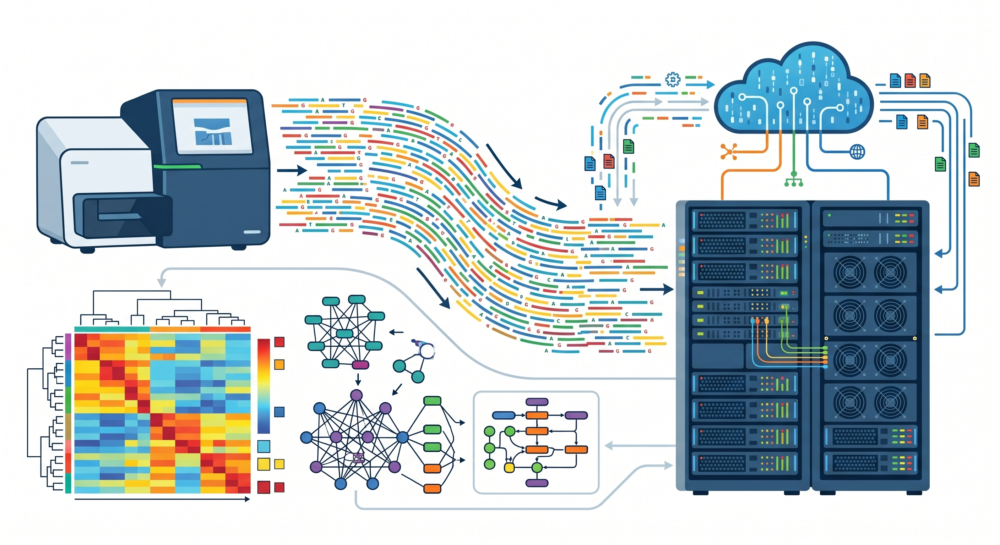
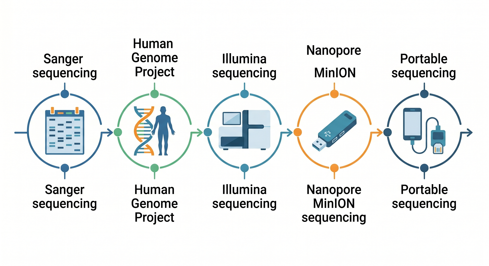
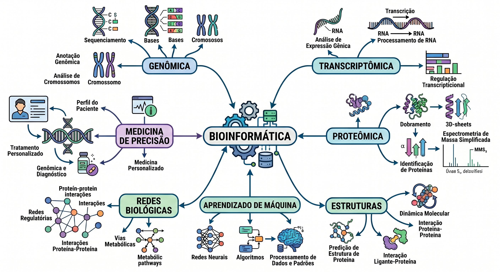
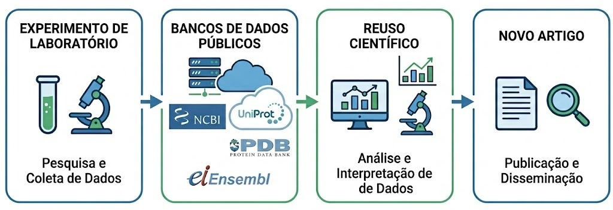
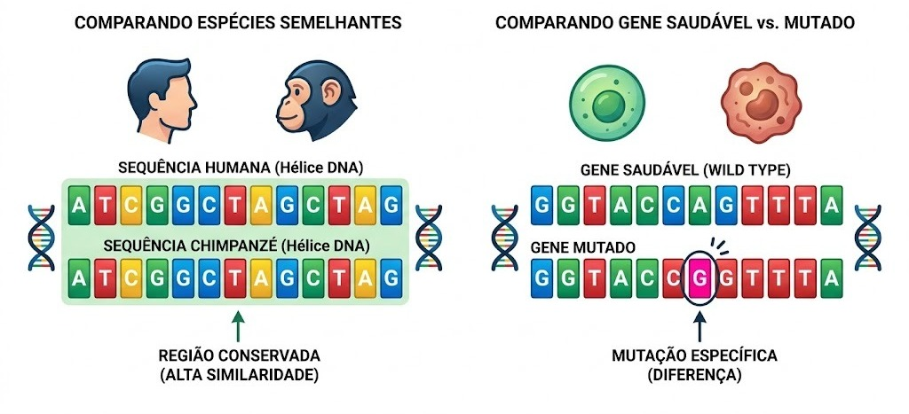
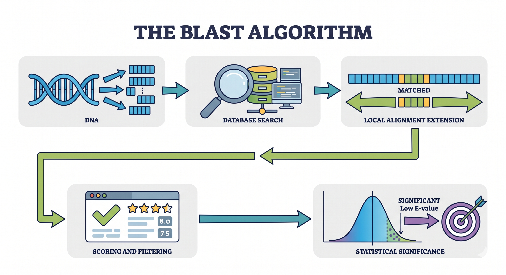
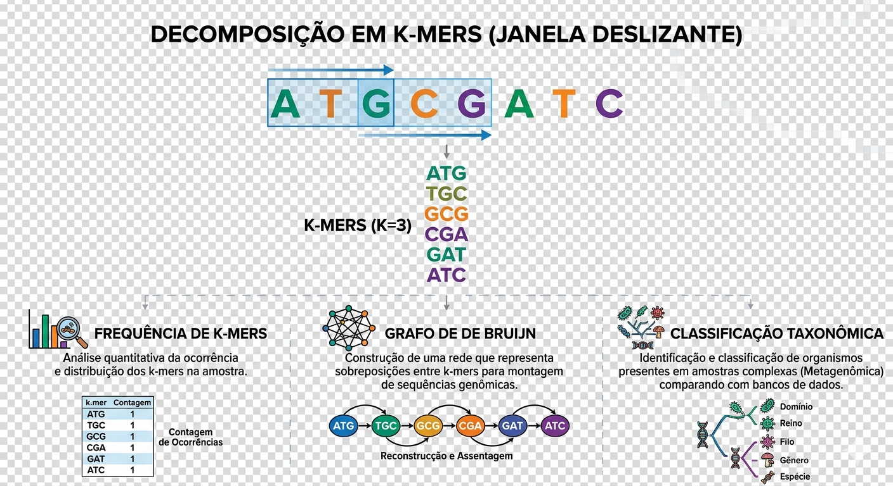
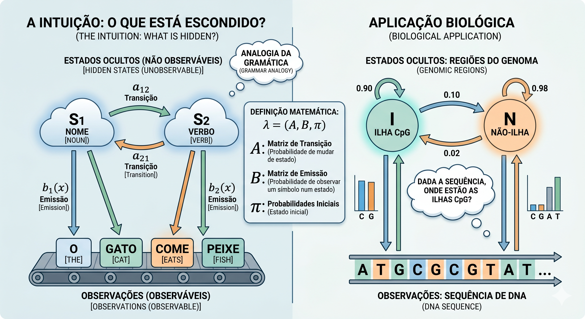

# Bioinformática - Conceitos Básicos
## {background-color="#1a1a2e"}

::: {style="text-align: center; margin-top: 15%;"}

[A biologia gerou mais dados do que]{style="font-size: 1.3em; color: #a0a0c0;"}

[humanos conseguem analisar.]{style="font-size: 1.3em; color: #a0a0c0;"}

<br>

[**O que fazemos com isso?**]{style="font-size: 2em; color: #e0e0ff; font-weight: 700;"}

:::

::: notes
**Tempo: ~30 segundos — gancho inicial**

O objetivo é criar uma pergunta na cabeça do aluno antes de qualquer definição.

"Alguém aqui já usou o NCBI, o BLAST, ou fez análise de sequências?"
:::

---

## Por que a bioinformática existe?

::: {.columns}

::: {.column width="55%"}

**O problema central:**

- Técnicas experimentais modernas produzem dados em escala industrial
- Um único experimento de RNA-seq gera **gigabytes** de dados brutos
- Análise manual é fisicamente impossível
- Ferramentas computacionais deixaram de ser *complemento* e passaram a ser **condição** para fazer biologia moderna

:::

::: {.column width="45%"}

> *"Biology is becoming an information science."*
>
> — [@sboner2011]

:::

:::

::: notes
**Tempo: ~1 minuto**

Não é sobre biologia computacional "teórica" é sobre o que acontece em qualquer laboratório de genômica hoje. Um experimento de sequenciamento de nova geração (NGS) que custa R$800 gera um arquivo que nenhum humano consegue olhar linha a linha.

Referência: Sboner et al. (2011), artigo muito citado que discute o custo real do sequenciamento considerando análise, não só geração de dados.
:::

---

## A queda do custo de sequenciamento

{fig-align="center" width="600"}

---

## A queda do custo de sequenciamento

::: {.columns}

::: {.column width="60%"}

**Projeto Genoma Humano (1990–2003):**

- Duração: 13 anos
- Custo: ~US$ 3 bilhões
- Consórcio internacional de 20 países [@lander2001]

**Hoje (2024):**

- Duração: **< 24 horas**
- Custo: **~US$ 100–200** por genoma completo
- Equipamento cabe em uma bancada de laboratório

:::

::: {.column width="40%"}

::: {.callout-note}
## Lei de Moore vs. sequenciamento

O custo de sequenciamento caiu **mais rápido** do que a Lei de Moore a partir de 2008, quando o sequenciamento de segunda geração (NGS) foi introduzido.

Fonte: NHGRI (2023)
:::


:::

:::

::: notes
**Tempo: ~1 minuto**

A comparação com a Lei de Moore é poderosa porque os alunos de biologia geralmente conhecem a analogia do custo de computação.

Pode abrir o site do NHGRI ao vivo: https://www.genome.gov/about-genomics/fact-sheets/Sequencing-Human-Genome-cost

A curva de custo mostra uma quebra em 2008 que é abrupta, é o momento em que o sequenciamento Illumina escalou comercialmente. Isso é visualmente muito mais forte do que qualquer argumento verbal.

**Dado adicional:** o GenBank dobra de tamanho a cada 18 meses desde 1982 [@benson2013].
:::


---

## A queda do custo de sequenciamento

{fig-align="center" width="600"}

---

## O que é bioinformática?

{fig-align="center" width="600"}

---

## O que é bioinformática?

::: {.columns}

::: {.column width="50%"}

**Definição operacional:**

> Bioinformática é o desenvolvimento e aplicação de métodos computacionais, matemáticos e estatísticos para adquirir, armazenar, organizar, analisar e interpretar dados biológicos.

— adaptado de [@luscombe2001]

:::

::: {.column width="50%"}

**Três pilares:**

```
        Biologia
           △
          / \
         /   \
        /  BI \
       /       \
      ▽─────────▽
Computação  Estatística
```

:::

:::

::: notes
**Tempo: ~45 segundos**

Esta definição é propositalmente ampla. Deixe claro que bioinformática não é só análise de sequências de DNA,  inclui imagens (bioimagem computacional), estruturas 3D, redes de proteínas, dados clínicos integrados com genômica (medicina de precisão), etc.

O diagrama simples dos três pilares é mais honesto do que um Diagrama de Venn elaborado. "Onde vocês se posicionam nesse triângulo?"

Referência: Luscombe, N.M., Greenbaum, D. & Gerstein, M. (2001). What is bioinformatics? A proposed definition and overview of the field. *Methods of Information in Medicine*, 40(4), 346–358.
:::

---

## Por que biólogos precisam entender os métodos?

::: {.incremental}

- **Ferramentas são caixas-pretas** — saber usar o BLAST não é o mesmo que entender o que o E-value significa

- **Parâmetros importam** — um k-mer de tamanho errado ou um threshold inadequado muda completamente o resultado biológico

- **Interpretação depende do método** — alinhamento global vs. local produzem conclusões diferentes sobre o mesmo par de sequências

- **Colaboração efetiva** — biólogos que entendem os limites dos métodos fazem perguntas melhores aos bioinformatas

- **Reprodutibilidade** — a crise de reprodutibilidade em biologia molecular tem componente computacional significativo [@baker2016]

:::

::: notes
**Tempo: ~1 minuto**

O ponto sobre reprodutibilidade costuma gerar discussão: 70% dos pesquisadores afirmam ter tentado replicar um experimento de outro grupo e falhado (Baker, 2016, Nature). Uma parcela significativa disso envolve análise computacional mal documentada ou parâmetros não reportados.

**Encerramento do bloco:** Principais ferramentas e ideias da bioinformática, não para você sair daqui programando, mas para você sair sabendo *o que está acontecendo* quando roda uma análise.
:::


# Representação de dados biológicos {.center}

Como traduzimos a biologia para o computador?

::: notes
Antes de falar em algoritmos e métodos, precisamos entender como a biologia se transforma em dado computacional. Toda a bioinformática começa nessa abstração.
:::

---

## A abstração fundamental

::: {.columns}

::: {.column width="50%"}

**Biologia → Estrutura de dados**

| Objeto biológico | Representação |
|---|---|
| DNA / RNA | String sobre $\{A, T, C, G\}$ |
| Proteína | String sobre 20 símbolos |
| Estrutura 3D | Coordenadas atômicas $(x, y, z)$ |
| Interações moleculares | Grafo $G = (V, E)$ |
| Expressão gênica | Matriz $n \times m$ |

:::

::: {.column width="50%"}

::: {.callout-important}
## Por que isso importa?

Cada escolha de representação define quais perguntas podemos fazer e quais algoritmos podemos usar.

Uma sequência como *string* permite busca de padrões. Como *vetor de frequências*, permite distâncias. Como *grafo de k-mers*, permite montagem.
:::

:::

:::

::: notes
**Tempo: ~1 min 30 s**

Este slide é conceitual e fundamental. A mensagem central é que a representação não é neutra: ela habilita certos métodos e inviabiliza outros.

Exemplo rápido para ilustrar: a mesma sequência de DNA pode ser representada como string (para alinhamento), como conjunto de k-mers (para montagem de genoma), ou como vetor de frequências (para classificação taxonômica). São três representações diferentes do mesmo dado, cada uma adequada a um problema diferente.
:::

---

## Formatos de arquivo: sequências

::: {.columns}

::: {.column width="50%"}

**FASTA** — o formato mais básico

```
>NM_007294.4 BRCA1, Homo sapiens
ATGGATTTATCTGCTCTTCGCGTTGAAGAAG
TACAAAATGTCATTAATGCTATGCAGAAAATC
```

- Cabeçalho: linha iniciada com `>`
- Sequência: uma ou mais linhas
- Aceita DNA, RNA e proteínas
- Sem informação de qualidade

:::

::: {.column width="50%"}

**FASTQ** — sequenciamento de nova geração

```
@SRR001666.1 HWI-EAS27:3:1:0:1020/1
GTTGCTTCTGGCGTGGGTGGGGGGG
+
IIIIIIIIIIIIIIIIIIIIIIIIH
```

- `@` + identificador do read
- Sequência bruta
- `+` separador
- Qualidade Phred por base: $Q = -10 \log_{10}(P_e)$

:::

:::

::: notes
**Tempo: ~1 min 30 s**

**FASTA** é o pão com manteiga da bioinformática. Toda análise começa aqui. O nome é uma contração de "FAST-All" (o programa original Fast-A de Lipman & Pearson, 1985).

**FASTQ**: o score de qualidade Phred é logarítmico. Q20 = 99% de acerto por base; Q30 = 99,9%. Um arquivo FASTQ de uma corrida de sequenciamento típica tem facilmente 30–50 GB. É aqui que entra a necessidade computacional.

**Para contextualizar aos alunos de biologia:** quando vocês mandam uma amostra para sequenciar e recebem "os dados", o que chegou é um ou mais arquivos FASTQ. Tudo que a bioinformática faz depois começa lendo essas linhas.
:::

---

## Formatos de arquivo: além das sequências

::: {.columns}

::: {.column width="50%"}

<!-- **PDB / mmCIF — estruturas 3D**

```
ATOM      1  N   MET A   1      
  38.000  74.212  19.898  1.00
ATOM      2  CA  MET A   1      
  38.983  73.134  19.854  1.00
```

- Coordenadas $(x, y, z)$ por átomo
- Arquivo médio: ~1–5 MB por estrutura
- Banco: [rcsb.org](https://rcsb.org) — >220.000 estruturas -->

**GFF3 / GTF — anotação genômica**

```
chr1  Ensembl  gene  11869  14409  .  +
  .  ID=ENSG00000223972
```

- Define onde estão genes, éxons, UTRs
- Sempre associado a um genoma de referência

:::

::: {.column width="50%"}

**Formatos de redes biológicas**

```
# SIF (Simple Interaction Format)
TP53  pp  MDM2
TP53  pp  CDKN1A
BRCA1 pp  TP53

# GraphML / edge list (STRING DB)
source  target  score
9606.ENSP00000269305  
9606.ENSP00000379512  0.999
```

::: {.callout-note}
## Padrão de fato
Quase toda análise em bioinformática começa convertendo entre esses formatos. Saber ler e escrever FASTA, FASTQ e GFF é habilidade básica.
:::

:::

:::

::: notes
**Tempo: ~1 min**

Não precisa entrar em detalhe técnico de todos os formatos. O ponto pedagógico é: cada tipo de dado biológico tem seu formato padrão, e esses formatos são a entrada dos algoritmos que vamos ver nos próximos blocos.

**Dado prático para mencionar:** o banco PDB tem hoje mais de 220.000 estruturas depositadas manualmente. Com o AlphaFold DB, esse número saltou para mais de 200 milhões de estruturas preditas, dois slides de diferença entre "o que a biologia experimental gerou em 50 anos" e "o que o aprendizado de máquina gerou em 2 anos". Guarda esse gancho para o Bloco 7.
:::

---

## Bancos de dados públicos

::: {.columns}

::: {.column width="55%"}

| Banco | Conteúdo | Referência |
|---|---|---|
| **GenBank / NCBI** | Sequências nucleotídicas | @benson2013 |
| **UniProt / Swiss-Prot** | Proteínas anotadas | @uniprot2023 |
| **PDB** | Estruturas 3D | @berman2000 |
| **Ensembl** | Genomas anotados | @cunningham2022 |
| **SRA** | Dados brutos de NGS | @leinonen2011 |
| **STRING** | Redes de interação | @szklarczyk2023 |

:::

::: {.column width="45%"}

::: {.callout-important}
## Ciência aberta na prática

Todo resultado publicado hoje exige depósito dos dados em banco público antes da aceitação do artigo.

GenBank dobra de tamanho a cada ~18 meses desde 1982 [@benson2013]. O SRA armazena atualmente mais de **50 petabytes** de dados de sequenciamento.
:::

:::

:::

::: notes
**Tempo: ~1 min**

**Mensagem principal:** esses bancos são infraestrutura científica global. São financiados publicamente (NCBI = NIH, EBI = EMBL) e de acesso livre.

**Por que isso importa para biólogos:** antes de fazer um experimento, vale verificar se o dado já existe depositado. A reanálise de dados públicos é uma área crescente e legítima de pesquisa.

**Gancho para a próxima seção:**
"Agora que sabemos como a biologia vira dado, a pergunta é: o que fazemos com essas sequências? A operação mais fundamental é compará-las e é isso que o alinhamento faz."

**Nota sobre o SRA:** o Sequence Read Archive do NCBI cresceu de forma exponencial com a queda do custo de sequenciamento. Hoje é um dos maiores repositórios científicos do mundo em volume de dados.
:::

---

## Bancos de dados públicos

{fig-align="center" width="600"}

---

# Alinhamento de sequências {.center}

A operação fundamental da bioinformática clássica

::: notes
**Transição do bloco anterior:**
"Agora que sabemos que sequências são strings sobre um alfabeto finito e que existem bilhões delas depositadas em bancos públicos, a pergunta natural é: como *comparamos* essas sequências? É exatamente isso que o alinhamento faz."
:::

---

## Por que alinhar sequências?

::: {.columns}

::: {.column width="55%"}

**Princípio central:**

> Sequências similares compartilham **ancestral comum** ou **função conservada**

```
Humano: MVLSPADKTNVKAAW-GKVGAHAGEYGAEAL
Rato:   MVLSGEDKSNIKAAW-GKIGGHGAEYGAEAL
Galinha:MVLSAADKNNVKGIF-TKIAGHAEEYGAETL
        ****  ** * ***  ** *  ** *****
```

- `*` posição 100% conservada
- ` ` substituição ou gap

:::

::: {.column width="45%"}

**Dois tipos de alinhamento:**

| | Global | Local |
|---|---|---|
| Abrangência | Sequência inteira | Região de interesse |
| Método | Needleman–Wunsch | Smith–Waterman |
| Uso típico | Sequências homólogas | Domínios, motivos |

::: {.callout-note}
## Aplicações práticas
Busca em bancos de dados, inferência filogenética, anotação funcional, detecção de variantes.
:::

:::

:::

::: notes
**Tempo: ~1 min 30 s**

O exemplo do alinhamento de hemoglobinas é ótimo para audiência de biologia, eles conhecem a proteína. Mencionar que esse alinhamento múltiplo foi o ponto de partida para entender que a hemoglobina de diferentes vertebrados descende de um ancestral comum.

**Ponto conceitual importante:** alinhamento é uma *hipótese* sobre homologia, não uma certeza. Um bom alinhamento computacional não prova ancestralidade, é evidência a ser interpretada.

A distinção global/local vai ser usada nos dois slides seguintes para motivar Needleman–Wunsch e Smith–Waterman separadamente.
:::

---

## Por que alinhar sequências?

{fig-align="center" width="600"}


---

## Programação dinâmica — Needleman–Wunsch

::: {.columns}

::: {.column width="50%"}

**A recorrência:**

$$F(i,j) = \max \begin{cases} F(i-1,\,j-1) + s(x_i, y_j) \\ F(i-1,\,j) - d \\ F(i,\,j-1) - d \end{cases}$$

- $s(x_i, y_j)$: score de match/mismatch
- $d$: penalidade de gap
- Preenchimento: linha por linha
- **Traceback:** caminho de volta revela o alinhamento

:::

::: {.column width="50%"}

<div style="margin-top: 200px;"></div>

**Exemplo** ($+1$ match, $-1$ mismatch, $-2$ gap):

```
        A   C   G   T
    0  -2  -4  -6  -8
A  -2   1  -1  -3  -5
G  -4  -1   0   0  -2
T  -6  -3  -2  -1   1
```

Alinhamento ótimo:

```
ACGT
A-GT   score = 1
```

:::

:::

::: notes
**Tempo: ~2 min**

**Para a audiência de biologia:** não precisa derivar a recorrência. O ponto é que a programação dinâmica garante encontrar o alinhamento ótimo, algo que força bruta nunca conseguiria em tempo razoável.

**Intuição da tabela:** cada célula responde "qual o melhor score para alinhar os primeiros $i$ caracteres de X com os primeiros $j$ de Y?". As três opções da recorrência correspondem a: (1) alinhar $x_i$ com $y_j$, (2) inserir um gap em Y, (3) inserir um gap em X.

**Complexidade:** O(n·m) em tempo e espaço, viável para sequências de centenas de aminoácidos, inviável para genomas inteiros.

**Smith–Waterman:** a única mudança é inicializar com 0 em vez de valores negativos, e zerar $F(i,j)$ se ficar negativo. Isso permite encontrar a melhor *sub-sequência* alinhada, não o alinhamento global completo. Vale mencionar que SW é mais sensível que NW para encontrar domínios conservados.

Referências clássicas: @needleman1970 e @smith1981.
:::

---

## Matrizes de substituição e penalidade de gap

::: {.columns}

::: {.column width="52%"}

**Por que não usar +1/–1 simples?**

Substituições não são equiprováveis:

**BLOSUM62** [@henikoff1992]:

- Derivada de blocos de alinhamentos reais (BLOCKS DB)
- O número indica identidade mínima usada (62%)
- Mais comum para proteínas divergentes
- **PAM**: modelo evolutivo alternativo

:::

::: {.column width="48%"}

**Gap penalty**

- Gap open: custo de iniciar um gap
- Gap extend: custo de estender um gap existente

:::

:::

:::

::: notes
**Tempo: ~1 min 30 s**

**BLOSUM vs PAM:** ambas funcionam, mas BLOSUM62 tornou-se o padrão para buscas em bancos de proteínas porque foi derivada empiricamente de alinhamentos reais, não de um modelo evolutivo. Para proteínas muito similares, use BLOSUM80; para muito divergentes, BLOSUM45.

**Gap affine:** o gap open costuma ser 11 e o gap extend 1 no BLAST padrão para proteínas. Isso reflete a observação de que uma inserção/deleção de 5 aminoácidos numa proteína é biologicamente mais plausível do que cinco inserções/deleções independentes de 1 aminoácido cada.

**Para engajar a turma:** "como vocês decidiriam se uma substituição é conservadora ou radical?" isso leva à discussão de propriedades físico-químicas dos aminoácidos, terreno familiar para biologia.
:::

---

## BLAST — escala para bilhões de sequências

::: {.columns}

::: {.column width="55%"}

**O problema de escala:**

- GenBank: > 4 × 10¹² bases (2024)
- NW contra o GenBank: **inviável**
- BLAST [@altschul1990]: heurística em três etapas

1. **Seeding** — encontra *words* (k-mers) de alto score na query
2. **Extension** — estende o alinhamento sem gaps (HSP)
3. **Evaluation** — calcula E-value e filtra resultados

:::

::: {.column width="45%"}

**E-value: a estatística do BLAST**

$$E = m \cdot n \cdot e^{-\lambda S}$$

- $m$, $n$: tamanhos da query e do banco
- $S$: bit-score do alinhamento
- $\lambda$: parâmetro normalizador

::: {.callout-note}
## Interpretando o E-value
$E = 10^{-5}$: espera-se 0,00001 hit ao acaso num banco deste tamanho.

**Não é p-value.** Quanto menor, mais significativo.
:::

:::

:::

::: notes
**Tempo: ~1 min 30 s**

**A heurística do BLAST:** a ideia central é que alinhamentos biologicamente significativos geralmente contêm ao menos um trecho de k nucleotídeos (ou aminoácidos) sem gaps com score alto. O BLAST encontra esses trechos ("seeds") de forma rápida com tabelas de hash, depois estende. Isso elimina a necessidade de calcular a matriz de programação dinâmica completa para cada sequência do banco.

**E-value na prática:** para busca de homólogos remotos, use E < 1e-3. Para validação de hits em análises mais exploratórias, E < 0,1 pode ser aceitável. Nunca reporte um hit como significativo sem checar o E-value.

**Variantes do BLAST:**
- `blastn`: nucleotídeo × nucleotídeo
- `blastp`: proteína × proteína
- `blastx`: nucleotídeo (6 frames) × proteína
- `tblastn`: proteína × nucleotídeo (6 frames)
- `tblastx`: nucleotídeo (6 frames) × nucleotídeo (6 frames)

Para alunos de biologia que vão usar o BLAST experimentalmente: o BLAST do NCBI online usa os mesmos algoritmos que a versão de linha de comando, a diferença é escala e automação.
:::

---

## BLAST — escala para bilhões de sequências

{fig-align="center" width="600"}

---

## Alinhamento múltiplo e aplicações

::: {.columns}

::: {.column width="55%"}

**MSA — Multiple Sequence Alignment**

- Estende o problema para $N$ sequências simultâneas
- Ótimo exato: $O(2^N \cdot L^N)$
- **Heurísticas progressivas:**
  - MUSCLE [@edgar2004]
  - MAFFT [@katoh2013]

**Princípio:** alinhar primeiro os pares mais similares, depois incorporar os demais (*guide tree*)

:::

::: {.column width="45%"}

**Aplicações do alinhamento**

```
MSA
 ├── Inferência filogenética
 │    └── (IQ-TREE, RAxML)
 ├── Detecção de conservação
 │    └── (pressão seletiva por sítio)
 ├── Anotação funcional
 │    └── (sítios ativos conservados)
 └── Profile HMMs
      └── (HMMER)
```

::: {.callout-important}
## Limitação fundamental
Alinhamento assume que posições homólogas estão na *mesma coluna*. Rearranjos, duplicações e recombinações violam essa premissa.
:::

:::

:::

::: notes
**Tempo: ~1 min**

**ClustalW vs MAFFT:** ClustalW foi dominante por décadas mas é lento para muitas sequências. MAFFT e MUSCLE são as escolhas atuais para análises rotineiras; MUSCLE3 é rápido sem sacrificar muito em qualidade.

**Conexão com o próximo bloco:** o slide fecha com "Profile HMMs → Bloco 5". Mencionar verbalmente: "O MSA não é o fim é a *entrada* para muitos outros métodos. Um dos mais poderosos é o Profile HMM, que veremos em breve."

**Limitação:** é importante que alunos de biologia entendam que quando uma região de um gene sofreu rearranjo, inserção de transposon, ou conversão gênica, o alinhamento pode produzir colunas biologicamente sem sentido. Isso não é falha do algoritmo é uma limitação inerente à representação.

"O alinhamento é poderoso, mas tem um custo computacional que cresce com o tamanho das sequências. Quando precisamos comparar genomas inteiros ou milhões de reads de metagenômica, precisamos de uma abordagem diferente e é aí que entram os métodos livres de alinhamento."
:::

---

# Métodos livres de alinhamento {.center}

Escalando para genomas, metagenomas e além

::: notes
**Transição do bloco anterior:**
"Vimos que o alinhamento por programação dinâmica é ótimo mas tem preço. O custo O(n·m) que funciona perfeitamente para comparar duas proteínas se torna proibitivo quando a escala vai para metagenômica e genômica. Como resolvemos isso?"
:::

---

## O problema de escala

::: {.columns}

::: {.column width="55%"}

**Onde o alinhamento falha:**

- **Metagenômica:** classificar $10^7$ reads contra $10^5$ genomas de referência
- **Montagem de novo:** comparar todos os pares de $10^9$ reads curtos
- **Genômica comparativa:** distância entre 10.000 genomas bacterianos

**Custo do alinhamento par-a-par:**

$$T(n, m) = O(n \cdot m)$$


:::

::: {.column width="45%"}

| Método | Complexidade | Escalabilidade |
|---|---|---|
| Smith–Waterman | $O(n \cdot m)$ | ✗ Genomas |
| BLAST | $O(n \cdot m \cdot \varepsilon)$ | △ Moderada |
| **k-mer / Mash** | $O(n + m)$ | ✓ Metagenômica |

::: {.callout-note}
## Intuição
Métodos livres de alinhamento trocam *precisão de posição* por *velocidade e escalabilidade* a pergunta deixa de ser "onde essas sequências diferem?" e passa a ser "o quão parecidas elas são?".
:::

:::

:::

::: notes
**Tempo: ~1 min**

Com $n = m = 3 \times 10^9$ (genoma humano):
$$T \approx 9 \times 10^{18} \text{ operações}$$

**Para motivar a transição:** pergunte à turma "quantas comparações par-a-par são necessárias para comparar 1.000 genomas entre si?" A resposta é C(1000,2) = 499.500. Com alinhamento, isso é fisicamente inviável em tempo hábil. Com k-mers, é possível em minutos em um laptop.

**Ponto pedagógico:** não é que o alinhamento seja "ruim" é que existe a ferramenta certa para cada escala e pergunta. Para confirmar a identidade de dois genes homólogos, alinhamento é o caminho. Para triagem rápida de um metagenoma inteiro, k-mers são a escolha.

O $\varepsilon$ no BLAST representa a fração da matriz de DP que é realmente calculada (por causa do seeding). Ainda assim, para comparação de genomas inteiros, é lento demais.
:::

---

## k-mers: a unidade fundamental

{fig-align="center" width="600"}

---

## k-mers: a unidade fundamental

**Definição:**

Dado uma sequência $S$ de comprimento $L$ e um inteiro $k$, os **k-mers** são todas as subsequências contíguas de comprimento $k$:

$$\text{k-mers}(S) = \{S[i \,{:}\, i+k] \mid 0 \leq i \leq L - k\}$$

**Exemplo** ($k = 3$):

```
S = G A T T A C A
    ├──┤           GAT
      ├──┤         ATT
        ├──┤       TTA
          ├──┤     TAC
            ├──┤   ACA
```

Total: $L - k + 1 = 7 - 3 + 1 = 5$ k-mers

::: notes
**Tempo: ~1 min 30 s**

**A assinatura genômica é real:** composições de dinucleotídeos e tetranucleotídeos variam entre organismos de forma suficientemente consistente para permitir classificação taxonômica. Isso foi observado empiricamente antes dos métodos computacionais, bactérias de ambientes extremos, por exemplo, têm composições GC muito distintas.

**Por que k-mers funcionam?** Dois genomas evolutivamente próximos compartilham a maioria dos seus k-mers (com k suficientemente grande). Dois genomas distantes têm poucos k-mers em comum. Isso é o princípio por trás do Mash e do Kraken2.

**Sobre o tamanho de k:** com $k = 31$, a probabilidade de que um 31-mer específico apareça ao acaso em outro genoma é $4^{-31} \approx 10^{-19}$, praticamente nula. Por isso k-mers grandes são muito específicos e permitem classificação taxonômica confiável.

:::

## k-mers: a unidade fundamental

**Vetor de frequências como assinatura:**

Para $k = 2$, DNA: $4^2 = 16$ possíveis 2-mers

```
         AA AC AG AT CA CG CT ...
Genoma A [0  3  1  2  0  4  1 ...]
Genoma B [0  3  1  1  0  4  2 ...]
Genoma C [2  0  3  0  1  0  3 ...]
```

- A e B têm perfis similares → provavelmente relacionados
- C tem perfil distinto → organismo diferente

**Escolha de $k$:**

- $k$ pequeno: rápido, mas inespecífico ($4^4 = 256$ possíveis)
- $k$ grande: específico, mas memória cresce ($4^{21} \approx 4 \times 10^{12}$)
- Prática: $k = 21$–$31$ para classificação taxonômica

---

## Aplicações: Kraken2, Jellyfish e MinHash

::: {.columns}

::: {.column width="50%"}

**Kraken2** — classificação taxonômica [@wood2019]

- Mapeia cada k-mer de um read ao nó mais específico da árvore taxonômica que contém esse k-mer
- Banco de dados: k-mers de todos os genomas de referência (NCBI RefSeq)
- Velocidade: $> 10^6$ reads/segundo em laptop comum

:::

::: {.column width="50%"}

**Jellyfish** — contagem de k-mers [@marcais2011]

- Contagem paralela e eficiente de k-mers em FASTQ
- Histograma de frequências → estimativa do tamanho do genoma

$$G \approx \frac{N - E}{M}$$

onde $N$ = total de k-mers, $E$ = k-mers com erro, $M$ = cobertura média
:::

:::

:::

::: notes
**Tempo: ~1 min 30 s**

**Kraken2 na prática:** é hoje o padrão para análises de microbioma e metagenômica. Um dos gargalos não é tempo de CPU, mas memória RAM: o banco de dados de k-mers do RefSeq completo ocupa ~70 GB de RAM. Existe uma versão de banco reduzido (~8 GB) para análises exploratórias.

**Jellyfish e tamanho de genoma:** o histograma de frequências de k-mers tem um pico no valor de cobertura média. K-mers com frequência 1 são provavelmente erros de sequenciamento. Este é um método padrão para estimar tamanho de genoma *antes* da montagem relevante para projetos de sequenciamento de organismos não-modelo.

:::

---

## Aplicações: Kraken2, Jellyfish e MinHash

**MinHash / Mash** — comparação em escala [@ondov2016]

1. Extraia todos os k-mers de dois genomas
2. Aplique uma função hash a cada k-mer
3. Retenha apenas os $s$ menores hashes (**sketch**)
4. Estime a similaridade de Jaccard:
5. Converta para distância evolutiva:

::: {.callout-note}
## Resultado prático
Comparar 10.000 genomas bacterianos par-a-par com Mash leva **minutos**, com BLAST, levaria meses.
:::

::: notes
**Tempo: ~1 min 30 s**

**MinHash:** a elegância do método é que o sketch é muito menor que o conjunto original de k-mers, tipicamente $s = 1000$ hashes representam um genoma inteiro com boa precisão estatística. A estimativa de Jaccard a partir do sketch tem erro controlado: $SE(\hat{J}) \approx \sqrt{J(1-J)/s}$.

**Conexão com Machine Learning:** vetores de frequência de k-mers são *features* naturais para ML e esse gancho vai aparecer no Bloco 7.
:::

---


## Distâncias baseadas em compressão

::: {.columns}

::: {.column width="55%"}

**Complexidade de Kolmogorov** [@li2004]

A complexidade $K(x)$ de uma string $x$ é o comprimento do menor programa que a gera

**Intuição central:**

> Sequências similares contêm informação redundante entre si, comprimem *melhor juntas* do que separadas.

:::

::: {.column width="45%"}

**NCD — Normalized Compression Distance** [@cilibrasi2005]


**Vantagem**

> Não requer alinhamento nem banco de referência. Funciona para qualquer tipo de sequência DNA, proteínas, linguagem natural, música.


:::

:::

::: notes
**Tempo: ~1 min**

**Por que Kolmogorov na bioinformática?** Porque a complexidade de Kolmogorov é a medida teórica de *quantidade de informação* de uma string. Duas sequências biologicamente relacionadas compartilham informação (ancestral comum) e, portanto, têm menor complexidade conjunta do que a soma das complexidades individuais.

**Limitação prática:** a NCD depende do compressor usado. Compressores diferentes dão resultados ligeiramente diferentes. Para sequências biológicas, LZW (base do gzip) funciona bem; para sequências longas, bzip2 (baseado em Burrows-Wheeler) costuma ser mais preciso.

**Aplicação real:** o artigo de Cilibrasi & Vitányi (2005) usou NCD para reconstruir árvores filogenéticas de vírus, mitocôndrias e genomas completos sem nenhum alinhamento e os resultados foram comparáveis aos de métodos clássicos baseados em alinhamento.

**Para a audiência:** a mensagem que fica é: "informação compartilhada entre sequências ≈ história evolutiva compartilhada". O compressor é apenas o instrumento de medição.
:::

---

## Escalabilidade: alinhamento vs. k-mer

```{r}
#| echo: false
#| fig-align: center
#| fig-height: 4
#| fig-width: 9
#| message: false
#| warning: false

library(ggplot2)
library(dplyr)
library(tibble)
library(scales)

n_seq <- 10^seq(1, 7, by = 0.25)

dados <- bind_rows(
  tibble(n = n_seq,
         tempo = n_seq^2 / 1e9,
         metodo = "Smith–Waterman  O(n²)"),
  tibble(n = n_seq,
         tempo = (n_seq * log10(n_seq)) / 1e6,
         metodo = "BLAST  O(n log n)"),
  tibble(n = n_seq,
         tempo = n_seq / 1e6,
         metodo = "k-mer / Mash  O(n)")
)

cores <- c(
  "Smith–Waterman  O(n²)"  = "#E24B4A",
  "BLAST  O(n log n)"      = "#BA7517",
  "k-mer / Mash  O(n)"     = "#1D9E75"
)

ggplot(dados, aes(x = n, y = tempo, color = metodo)) +
  geom_line(linewidth = 1.3) +
  scale_x_log10(
    labels = label_number(scale_cut = cut_short_scale()),
    breaks = 10^(1:7)
  ) +
  scale_y_log10(
    labels = label_number(scale_cut = cut_short_scale(), suffix = " s"),
    breaks = 10^(-3:6)
  ) +
  scale_color_manual(values = cores) +
  annotate("rect",
           xmin = 10^6, xmax = 10^7,
           ymin = 10^-3, ymax = 10^6.5,
           fill = "#1D9E75", alpha = 0.06) +
  annotate("text", x = 3e6, y = 2e-3,
           label = "escala de\nmetagenômica",
           color = "#0F6E56", size = 3.2, fontface = "italic") +
  labs(
    x = "Número de sequências comparadas",
    y = "Tempo estimado (escala log)",
    color = NULL
  ) +
  theme_minimal(base_size = 13) +
  theme(
    legend.position   = "bottom",
    panel.grid.minor  = element_blank(),
    legend.text       = element_text(size = 11)
  )
```

::: notes
**Tempo: ~30 s**

O gráfico é propositalmente em escala log–log para que as diferenças de ordem de grandeza fiquem visíveis. Na escala linear, Smith–Waterman desapareceria no eixo enquanto k-mer ainda seria uma linha reta.

**Mensagem rápida para o slide:** "Na região sombreada, que corresponde à escala de um experimento de metagenômica típico, Smith–Waterman é inviável, BLAST é lento, e k-mer escala linearmente."

**Nota técnica:** os tempos no gráfico são relativos (normalizados arbitrariamente), o ponto é a *inclinação* das curvas em escala log, não os valores absolutos. Em log–log, O(n) é uma reta de inclinação 1, O(n log n) de inclinação ~1 (ligeiramente curva), e O(n²) de inclinação 2.

**Transição para o Bloco 5:**
"Voltamos agora à análise de sequências individuais, mas com uma abordagem probabilística. Quando queremos não só comparar, mas *modelar* a estrutura estatística de famílias de sequências, a ferramenta são os Hidden Markov Models."
:::

---

# Modelos probabilísticos: HMMs {.center}

Quando a biologia tem estados que não podemos observar diretamente

::: notes
**Transição do bloco anterior:**
"Até agora trabalhamos com métodos que olham diretamente para as sequências, alinhamento, k-mers, compressão. Agora vamos um nível acima: e se a sequência que observamos for apenas a *superfície* de um processo mais profundo que não enxergamos? Esse é o território dos modelos ocultos de Markov."
:::

---

## Modelos probabilísticos: HMMs

{fig-align="center" width="600"}

---

## A intuição: o que está *escondido*?

::: {.columns}

::: {.column width="55%"}

**O problema central em biologia:**

Observamos nucleotídeos. O que *não* observamos:

- Se estamos numa **ilha CpG** ou num região comum
- Se um trecho é **éxon**, **íntron** ou região intergênica
- Se uma posição numa proteína pertence a um **domínio funcional**

:::

::: {.column width="45%"}

**Estrutura geral:**

```
Estados ocultos:
  ┌───┐  a₁₁  ┌───┐
  │ S₁│ ←───→ │ S₂│
  └─┬─┘       └─┬─┘
    │ b₁(x)     │ b₂(x)
    ↓           ↓
Observações:
  A T C G ...  A T C G ...
```

::: {.callout-note}
## Analogia da gramática
Um HMM é uma **gramática probabilística**: estados são categorias gramaticais, transições são regras sintáticas, emissões são as palavras. A sequência de DNA é o texto, a estrutura subjacente é o que queremos descobrir.
:::

:::

:::

::: notes
**Tempo: ~1 min 30 s**

**A analogia da gramática** é a mais acessível para alunos de biologia. Explique assim: "Em português, um sujeito pode ser seguido de verbo, e um verbo pode ser seguido de objeto, isso é uma transição. Cada categoria gramatical produz certas palavras com certas probabilidades, isso é emissão. Dado uma frase, podemos *inferir* a estrutura gramatical mesmo sem marcadores explícitos. O HMM faz exatamente isso com sequências biológicas."

**Por que Markov?** A propriedade de Markov diz que o próximo estado depende *apenas* do estado atual, não do histórico completo. Isso é uma simplificação, a biologia é mais complexa, mas é suficiente para capturar muita estrutura real.

**Por que oculto?** Porque os estados (éxon, íntron, ilha CpG) não estão escritos na sequência, precisamos *inferir* qual estado gerou cada posição. Se os estados fossem observáveis, seria um simples modelo de Markov.
:::

---

## A intuição: o que está *escondido*?

::: {.columns}

::: {.column width="55%"}

**Um HMM é definido por três componentes:**

$$\lambda = (A,\; B,\; \pi)$$

- $A$: matriz de **transição** entre estados ocultos
- $B$: matriz de **emissão** (símbolo observado dado o estado)
- $\pi$: distribuição de **estados iniciais**

:::

::: {.column width="45%"}

**Estrutura geral:**

```
Estados ocultos:
  ┌───┐  a₁₁  ┌───┐
  │ S₁│ ←───→ │ S₂│
  └─┬─┘       └─┬─┘
    │ b₁(x)     │ b₂(x)
    ↓           ↓
Observações:
  A T C G ...  A T C G ...
```

::: {.callout-note}
## Analogia da gramática
Um HMM é uma **gramática probabilística**: estados são categorias gramaticais, transições são regras sintáticas, emissões são as palavras. A sequência de DNA é o texto, a estrutura subjacente é o que queremos descobrir.
:::

:::

:::

::: notes
**Tempo: ~1 min 30 s**

**A analogia da gramática** é a mais acessível para alunos de biologia. Explique assim: "Em português, um sujeito pode ser seguido de verbo, e um verbo pode ser seguido de objeto, isso é uma transição. Cada categoria gramatical produz certas palavras com certas probabilidades, isso é emissão. Dado uma frase, podemos *inferir* a estrutura gramatical mesmo sem marcadores explícitos. O HMM faz exatamente isso com sequências biológicas."

**Por que Markov?** A propriedade de Markov diz que o próximo estado depende *apenas* do estado atual, não do histórico completo. Isso é uma simplificação, a biologia é mais complexa, mas é suficiente para capturar muita estrutura real.

**Por que oculto?** Porque os estados (éxon, íntron, ilha CpG) não estão escritos na sequência, precisamos *inferir* qual estado gerou cada posição. Se os estados fossem observáveis, seria um simples modelo de Markov.
:::

---

## Exemplo: ilhas CpG

::: {.columns}

::: {.column width="52%"}

**Dois estados ocultos:**

- **I** (island): região com CpG não metilado, GC-rica
- **N** (non-island): resto do genoma, CpG suprimido por metilação

**Probabilidades de emissão $B$:**

| Base | P(base \| **I**) | P(base \| **N**) |
|:----:|:----------------:|:----------------:|
| A    | 0.25             | 0.30             |
| C    | 0.25             | 0.20             |
| G    | 0.25             | 0.20             |
| T    | 0.25             | 0.30             |

*(versão simplificada — modelos reais usam dinucleotídeos)*

:::

::: {.column width="48%"}

**Probabilidades de transição $A$:**

```
           → I      → N
De I      0.90    0.10
De N      0.02    0.98
```

**Interpretação biológica:**

- De I → I (0.90): ilhas são regiões contíguas longas
- De N → N (0.98): a maior parte do genoma é não-ilha
- De N → I (0.02): transições são raras, fronteiras bem definidas

:::

:::

::: notes
**Tempo: ~1 min**

**Por que CpG é suprimido fora das ilhas?** Citosinas em contexto CpG podem ser metiladas (5-metilcitosina). Metilcitosina desaminada espontaneamente vira timina, causando mutação C→T. Ao longo da evolução, regiões metiladas acumulam mutações C→T, suprimindo CpG. Ilhas CpG escapam dessa pressão por serem geralmente não metiladas (regiões promotoras ativas).

**Conexão com epigenética:** ilhas CpG são biologicamente importantes, ~60% dos promotores de genes humanos estão associados a ilhas CpG. Hipermetilação de ilhas CpG em promotores é um mecanismo de silenciamento gênico em câncer.

**O modelo simplificado aqui usa emissões de nucleotídeos simples.** Na prática (como no artigo clássico de Durbin et al., 1998), usa-se emissões de dinucleotídeos para capturar melhor a supressão de CpG. O princípio é o mesmo.
:::

---

## Exemplo: ilhas CpG

::: {.columns}

::: {.column width="52%"}

**Dois estados ocultos:**

- **I** (island): região com CpG não metilado, GC-rica
- **N** (non-island): resto do genoma, CpG suprimido por metilação

**Probabilidades de emissão $B$:**

| Base | P(base \| **I**) | P(base \| **N**) |
|:----:|:----------------:|:----------------:|
| A    | 0.25             | 0.30             |
| C    | 0.25             | 0.20             |
| G    | 0.25             | 0.20             |
| T    | 0.25             | 0.30             |

*(versão simplificada — modelos reais usam dinucleotídeos)*

:::

::: {.column width="48%"}

**Probabilidades de transição $A$:**

```
           → I      → N
De I      0.90    0.10
De N      0.02    0.98
```
::: {.callout-important}
## A pergunta do HMM
Dada a sequência observada `ACGCGCGTATAT...`, qual a sequência mais provável de estados **I/N** que a gerou?
:::

:::

:::

::: notes
**Tempo: ~1 min**

**Por que CpG é suprimido fora das ilhas?** Citosinas em contexto CpG podem ser metiladas (5-metilcitosina). Metilcitosina desaminada espontaneamente vira timina — causando mutação C→T. Ao longo da evolução, regiões metiladas acumulam mutações C→T, suprimindo CpG. Ilhas CpG escapam dessa pressão por serem geralmente não metiladas (regiões promotoras ativas).

**Conexão com epigenética:** ilhas CpG são biologicamente importantes — ~60% dos promotores de genes humanos estão associados a ilhas CpG. Hipermetilação de ilhas CpG em promotores é um mecanismo de silenciamento gênico em câncer.

**O modelo simplificado aqui usa emissões de nucleotídeos simples.** Na prática (como no artigo clássico de Durbin et al., 1998), usa-se emissões de dinucleotídeos para capturar melhor a supressão de CpG. O princípio é o mesmo.
:::

---


## Os três problemas do HMM

::: {.columns}

::: {.column width="33%"}

**1. Avaliação**  
*"Qual a probabilidade desta sequência dado o modelo?"*  
**Algoritmo Forward**

Soma sobre todos os caminhos possíveis de estados que poderiam ter gerado a sequência.

Útil para: comparar qual modelo (organismo) melhor explica um read.

:::

::: {.column width="33%"}

**2. Decodificação**  
*"Qual a sequência de estados mais provável?"*

**Algoritmo de Viterbi**

Programação dinâmica: encontra o caminho de estados com maior probabilidade conjunta.

Útil para: anotar regiões — éxon, íntron, CpG, domínio.

:::

::: {.column width="33%"}

**3. Treinamento**  
*"Quais parâmetros melhor explicam os dados?"*  
**Baum–Welch (EM)**

EM: itera entre estimar os estados ocultos e re-estimar os parâmetros.

Útil para: aprender um modelo a partir de sequências sem anotação.

:::

:::


::: notes
**Tempo: ~1 min**

**Viterbi vs. Forward:** Viterbi encontra o *melhor* caminho único (max-product); Forward soma *todos* os caminhos possíveis (sum-product). Para anotação biológica (onde está o éxon?), usamos Viterbi. Para pontuação de uma sequência contra um modelo de família proteica, usamos Forward.

**Baum–Welch:** é um caso especial do algoritmo EM (Expectation-Maximization). O passo E estima a probabilidade de cada estado em cada posição; o passo M re-estima os parâmetros $A$, $B$, $\pi$ usando essas probabilidades como pesos. Converge a um ótimo local, não garantidamente global.

**Para a audiência:** "Esses três algoritmos, Forward, Viterbi, Baum-Welch, aparecem em praticamente todo software de bioinformática que usa HMMs. Você não precisa implementá-los, mas saber *para que servem* muda a forma como você interpreta os resultados."
:::

---

## Os três problemas do HMM

::: {.columns}

::: {.column width="33%"}

**1. Avaliação**  
*"Qual a probabilidade desta sequência dado o modelo?"*  
**Algoritmo Forward**

:::

::: {.column width="33%"}

**2. Decodificação**  
*"Qual a sequência de estados mais provável?"*

**Algoritmo de Viterbi**


:::

::: {.column width="33%"}

**3. Treinamento**  
*"Quais parâmetros melhor explicam os dados?"*  
**Baum–Welch (EM)**

:::

:::

::: {.callout-note}
## Viterbi na prática
É análogo à programação dinâmica do alinhamento, preenche uma matriz de scores, mas agora as linhas são **estados** e as colunas são **posições na sequência**.
:::

::: notes
**Tempo: ~1 min**

**Viterbi vs. Forward:** Viterbi encontra o *melhor* caminho único (max-product); Forward soma *todos* os caminhos possíveis (sum-product). Para anotação biológica (onde está o éxon?), usamos Viterbi. Para pontuação de uma sequência contra um modelo de família proteica, usamos Forward.

**Baum–Welch:** é um caso especial do algoritmo EM (Expectation-Maximization). O passo E estima a probabilidade de cada estado em cada posição; o passo M re-estima os parâmetros $A$, $B$, $\pi$ usando essas probabilidades como pesos. Converge a um ótimo local, não garantidamente global.

**Para a audiência:** "Esses três algoritmos, Forward, Viterbi, Baum-Welch, aparecem em praticamente todo software de bioinformática que usa HMMs. Você não precisa implementá-los, mas saber *para que servem* muda a forma como você interpreta os resultados."
:::

---

## Profile HMMs e HMMER

::: {.columns}

::: {.column width="55%"}

**Da MSA ao Profile HMM** [@eddy2011]:

```
MSA de 3 sequências:
  seq1  ACDEFGHIKLM
  seq2  ACD--GHIKLM
  seq3  ACDEFGHIK-M
       ↓  ↓  ↓  ↓  ↓
       M  D  M  I  M   ← tipo de estado
```
Cada coluna da MSA vira um **estado de match (M)**:

- Probabilidades de emissão = frequência de aminoácidos na coluna
- Colunas com muitos gaps → **estado de deleção (D)**
- Inserções entre colunas → **estado de inserção (I)**

:::

::: {.column width="45%"}

**Estrutura do Profile HMM:**

```
     M₁ → M₂ → M₃ → ... → Mₙ
    ↗↑↘  ↗↑↘  ↗↑↘        ↗↑↘
  I₀  D₁  I₁  D₂  I₂  ...  Dₙ
```

**HMMER** — busca de homólogos distantes:

- Muito mais sensível que BLAST para proteínas divergentes
- Pfam: banco de > 19.000 famílias de domínios como Profile HMMs [@mistry2021]

:::

:::

::: notes
**Tempo: ~1 min 30 s**

**Por que Profile HMMs são mais sensíveis que BLAST?** Porque capturam a *variabilidade* de cada posição na família. Uma posição que aceita Lys ou Arg (mas nunca Pro) terá emissões altas para K e R e quase zero para P. O BLAST trata cada aminoácido como uma substituição genérica usando BLOSUM, o Profile HMM usa a distribuição real aprendida dos dados.

**Pfam na prática:** quando você roda InterPro ou HMMER em uma proteína nova, está comparando ela contra milhares de Profile HMMs. O resultado é uma anotação de domínios, "essa proteína tem um domínio kinase C-terminal e um domínio de ligação a ATP N-terminal". Isso é muito mais informativo do que um BLAST hit genérico.

**Stochasic e Stockholm format (.sto):** o HMMER usa o formato Stockholm para MSA de entrada, similar ao FASTA mas com anotações de conservação por coluna. Vale mencionar brevemente para alunos que forem usar a ferramenta.

**Conexão com o próximo bloco:** Profile HMMs são modelos de sequências lineares. E quando o que queremos modelar é uma *rede* de interações, não uma sequência, mas um grafo? Esse é o tema do Bloco 6.
:::

---

## Aplicações dos HMMs em biologia

::: {.columns}

::: {.column width="50%"}

**Predição de genes** [@stanke2008]

```
Genoma:
──────[éxon]──[íntron]──[éxon]──
        ↑                  ↑
   estado M           estado M
   (alta prob.         (alta prob.
    de códon)           de códon)

Ferramentas: GENSCAN, Augustus, GlimmerHMM
```

**Detecção de ilhas CpG**

- Identificação de promotores e regiões regulatórias
- Relevante para epigenômica e estudo de expressão gênica

:::

::: {.column width="50%"}

**Anotação de domínios funcionais**

- Pfam + HMMER: ~80% das proteínas humanas têm ao menos um domínio anotado
- InterPro integra múltiplos bancos de Profile HMMs

:::

:::

::: notes
**Tempo: ~1 min**

**Predição de genes como HMM:** o modelo tem estados para: região intergênica, início de gene (ATG), éxon, sítio doador de splicing (5'), íntron, sítio aceptor (3'), éxon continuado, stop codon, fim de gene. As transições codificam as restrições biológicas (éxon não pode ir diretamente para outro éxon sem íntron, etc.). Augustus, por exemplo, treina esses parâmetros de forma específica para cada organismo.

**Covariance Models (CMs):** são HMMs em árvore, não lineares. Eles modelam tanto a sequência quanto a estrutura secundária de RNA, capturando pares de bases complementares. O Rfam usa CMs para anotar tRNAs, rRNAs, riboswitches, miRNAs, etc.

**Gancho para Bloco 7:** "A limitação dos HMMs é que a propriedade de Markov restringe a memória, o estado atual depende apenas do estado anterior. RNNs e Transformers superam isso, mantendo contexto de sequência muito mais longo. Mas o princípio de *estado latente que gera observações* continua sendo o mesmo."

**Transição para o Bloco 6:**
"HMMs modelam sequências lineares de DNA e proteínas. Mas a biologia é cheia de relações não-lineares, proteínas que interagem, genes que se regulam mutuamente, metabolitos conectados em vias. Para isso, precisamos de outra linguagem matemática: grafos e redes."
:::

---

## Aplicações dos HMMs em biologia

::: {.columns}

::: {.column width="50%"}

**Predição de genes** [@stanke2008]

```
Genoma:
──────[éxon]──[íntron]──[éxon]──
        ↑                  ↑
   estado M           estado M
   (alta prob.         (alta prob.
    de códon)           de códon)

Ferramentas: GENSCAN, Augustus, GlimmerHMM
```

**Detecção de ilhas CpG**

- Identificação de promotores e regiões regulatórias
- Relevante para epigenômica e estudo de expressão gênica

:::

::: {.column width="50%"}

**Estrutura de RNA**

- Covariance Models (CMs): extensão dos HMMs para capturar pares de bases
- Rfam: banco de famílias de RNA não-codificante [@kalvari2021]

::: {.callout-important}
## HMMs como fundação
Redes neurais recorrentes (RNNs) e Transformers podem ser entendidos como generalizações não-lineares dos HMMs, com capacidade de capturar dependências de longo alcance que HMMs clássicos não conseguem.
:::

:::

:::

::: notes
**Tempo: ~1 min**

**Predição de genes como HMM:** o modelo tem estados para: região intergênica, início de gene (ATG), éxon, sítio doador de splicing (5'), íntron, sítio aceptor (3'), éxon continuado, stop codon, fim de gene. As transições codificam as restrições biológicas (éxon não pode ir diretamente para outro éxon sem íntron, etc.). Augustus, por exemplo, treina esses parâmetros de forma específica para cada organismo.

**Covariance Models (CMs):** são HMMs em árvore, não lineares. Eles modelam tanto a sequência quanto a estrutura secundária de RNA, capturando pares de bases complementares. O Rfam usa CMs para anotar tRNAs, rRNAs, riboswitches, miRNAs, etc.

**Gancho para Bloco 7:** "A limitação dos HMMs é que a propriedade de Markov restringe a memória, o estado atual depende apenas do estado anterior. RNNs e Transformers superam isso, mantendo contexto de sequência muito mais longo. Mas o princípio de *estado latente que gera observações* continua sendo o mesmo."

**Transição para o Bloco 6:**
"HMMs modelam sequências lineares de DNA e proteínas. Mas a biologia é cheia de relações não-lineares, proteínas que interagem, genes que se regulam mutuamente, metabolitos conectados em vias. Para isso, precisamos de outra linguagem matemática: grafos e redes."
:::

---

# Grafos e redes complexas {.center}

Quando a biologia é naturalmente um problema de rede

::: notes
**Transição do bloco anterior:**
"HMMs modelam sequências lineares — uma posição após a outra. Mas grande parte da biologia não é linear: proteínas interagem entre si, genes se regulam mutuamente, metabolitos estão conectados em vias ramificadas. Para representar e analisar essas relações, precisamos de grafos."
:::

---

## Grafos de De Bruijn: montagem de genomas

::: {.columns}

::: {.column width="52%"}

**O problema da montagem:**

Sequenciamento produz milhões de reads curtos precisamos reconstruir o genoma original sem tê-lo como referência.

**Grafo de De Bruijn** [@zerbino2008]:

- **Nós:** $(k-1)$-mers únicos
- **Arestas:** $k$-mers que conectam dois $(k-1)$-mers sobrepostos


:::

::: {.column width="48%"}

**Exemplo** ($k = 3$, reads: `ATCG`, `TCGA`, `CGAT`):

```
   ATC       TCG       CGA       GAT
AT ──→ TC ──→ CG ──→ GA ──→ AT
 ↑                              │
 └──────────────────────────────┘
```

Caminho Euleriano → sequência montada: `ATCGAT`


**Por que grafos funcionam aqui?**  
Cada read define um **caminho** no grafo. A montagem é encontrar o caminho que percorre cada aresta exatamente uma vez, o **caminho Euleriano**.

:::

:::

::: notes
**Tempo: ~1 min 15 s**

**Por que De Bruijn e não overlap graph?** O grafo de overlap (OLC — Overlap-Layout-Consensus) conecta reads que se sobrepõem diretamente. Funciona bem para reads longas (PacBio, Oxford Nanopore). Para reads curtas (Illumina), o número de sobreposições par-a-par é astronomicamente grande, O(n²). O grafo de De Bruijn resolve isso indiretamente via k-mers: em vez de comparar reads entre si, cada read é fragmentada em k-mers e o grafo é construído em O(n·L/k), muito mais eficiente.

**Repetições são o grande problema:** se uma sequência `ACGTACGT` aparece em duas regiões do genoma, os k-mers dela criam um nó no grafo de De Bruijn que tem duas entradas e duas saídas, o assembler não sabe qual saída seguir. Isso cria "bolhas" e "tips" no grafo que precisam ser resolvidas heuristicamente.

**SPAdes:** usa múltiplos valores de k simultaneamente (multik-mer), o que aumenta drasticamente a qualidade da montagem. É o padrão atual para montagem de genomas bacterianos.
:::

---


## Grafos de De Bruijn: montagem de genomas

::: {.columns}

::: {.column width="50%"}

**O problema da montagem:**

Sequenciamento produz milhões de reads curtos precisamos reconstruir o genoma original sem tê-lo como referência.

**Grafo de De Bruijn** [@zerbino2008]:

- **Nós:** $(k-1)$-mers únicos
- **Arestas:** $k$-mers que conectam dois $(k-1)$-mers sobrepostos


:::

::: {.column width="50%"}

::: {.callout-note}
## Complicações reais
- Erros de sequenciamento → arestas espúrias
- Regiões repetitivas → bifurcações no grafo
- Cobertura não uniforme → nós com poucos reads

**SPAdes** [@bankevich2012] e **Velvet** [@zerbino2008] resolvem isso com múltiplos valores de $k$ e simplificação iterativa do grafo.
:::

:::

:::

::: notes
**Tempo: ~1 min 15 s**

**Por que De Bruijn e não overlap graph?** O grafo de overlap (OLC — Overlap-Layout-Consensus) conecta reads que se sobrepõem diretamente. Funciona bem para reads longas (PacBio, Oxford Nanopore). Para reads curtas (Illumina), o número de sobreposições par-a-par é astronomicamente grande — O(n²). O grafo de De Bruijn resolve isso indiretamente via k-mers: em vez de comparar reads entre si, cada read é fragmentada em k-mers e o grafo é construído em O(n·L/k), muito mais eficiente.

**Repetições são o grande problema:** se uma sequência `ACGTACGT` aparece em duas regiões do genoma, os k-mers dela criam um nó no grafo de De Bruijn que tem duas entradas e duas saídas — o assembler não sabe qual saída seguir. Isso cria "bolhas" e "tips" no grafo que precisam ser resolvidas heuristicamente.

**SPAdes:** usa múltiplos valores de k simultaneamente (multik-mer), o que aumenta drasticamente a qualidade da montagem. É o padrão atual para montagem de genomas bacterianos.
:::

---

## Redes biológicas: tipos e exemplos

::: {.columns}

::: {.column width="55%"}

| Rede | Nós | Arestas | Banco |
|---|---|---|---|
| **PPI** | Proteínas | Interação física | STRING, BioGRID |
| **Metabólica** | Metabolitos | Reações | KEGG, BiGG |
| **Co-expressão** | Genes | Correlação de expressão | WGCNA |
| **Regulatória** | TFs, genes | Regulação transcricional | JASPAR, RegulonDB |
| **Genômica** | Genes | Co-ocorrência / sintenia | OrthoFinder |

**Representação formal:**

$$G = (V,\, E,\, w) \quad \text{ou} \quad G = (V,\, E)$$

- Dirigido vs. não-dirigido
- Ponderado vs. binário
- Uni- vs. bipartido

:::

::: {.column width="45%"}

::: {.callout-note}
## PPI na prática
A rede PPI humana (interactoma) tem:

- ~20.000 proteínas como nós
- ~300.000–600.000 interações estimadas
- Apenas ~10% documentadas experimentalmente

:::

::: {.callout-important}
## Co-expressão ≠ interação física
WGCNA [@langfelder2008] agrupa genes com perfis de expressão similares entre condições, não implica contato direto entre as proteínas. Módulos de co-expressão são hipóteses funcionais, não interações confirmadas.
:::

:::

:::

::: notes
**Tempo: ~1 min**

**STRING DB:** integra evidências experimentais, co-expressão, co-ocorrência filogenética e predições de literatura. Cada interação tem um score de confiança de 0 a 1000. Muito usado para enriquecimento e visualização de redes PPI.

**KEGG:** mapas de vias metabólicas e de sinalização curados manualmente. Muito usado em análises de enriquecimento após RNA-seq e proteômica.

**WGCNA (Weighted Gene Co-expression Network Analysis):** constrói uma rede onde o peso de cada aresta é a correlação de Pearson elevada a uma potência $\beta$ (soft thresholding) escolhida para que a rede resultante tenha propriedades livre de escala. Muito popular em transcriptômica — permite encontrar módulos de genes co-regulados e correlacioná-los com traits fenotípicos.

**Bipartido:** redes de interação droga-alvo, vírus-hospedeiro, miRNA-mRNA são bipartidas — dois tipos de nós, e arestas só existem entre tipos diferentes.
:::

---

## Propriedades emergentes das redes biológicas

::: {.columns}

::: {.column width="50%"}

**Distribuição de grau livre de escala** [@barabasi1999]:

$$P(k) \sim k^{-\gamma}, \quad \gamma \approx 2\text{–}3$$

- Maioria dos nós tem poucos vizinhos
- Poucos nós (**hubs**) têm centenas de conexões
- Resultado de **crescimento preferencial**: novos nós conectam-se preferencialmente a nós já bem conectados


:::

::: {.column width="50%"}

**Hubs biológicos:**

> Proteínas hub (alto grau) tendem a ser **essenciais**, sua remoção leva à morte celular [@jeong2001]

:::

:::

::: notes
**Tempo: ~1 min 15 s**

**Livre de escala vs. aleatória (Erdős-Rényi):** numa rede aleatória, a distribuição de grau é Poisson — concentrada em torno da média, sem hubs. Redes livres de escala têm uma cauda pesada (power law) — hubs com grau muito acima da média são raros mas existem e são fundamentalmente importantes.

**Por que hubs são essenciais?** A hipótese "centrality-lethality" de Jeong et al. (2001) mostrou em S. cerevisiae que proteínas com mais interações (alto grau) têm maior probabilidade de ser essenciais quando deletadas. A intuição é que hubs integram muitos processos celulares simultaneamente — removê-los desestrutura o interactoma.

**Coeficiente de agrupamento:** $C_i = 1$ significa que todos os vizinhos de $i$ também são vizinhos entre si (clique). $C_i = 0$ significa que nenhum par de vizinhos de $i$ está conectado diretamente.

**Aplicação em farmacologia:** hubs como alvos terapêuticos são uma faca de dois gumes — alta eficácia potencial, mas também alta toxicidade (o hub provavelmente participa de vias essenciais em tecidos saudáveis). Alvos na periferia da rede (baixo grau, módulo específico de tecido) podem ser mais seletivos.
:::

---

## Propriedades emergentes das redes biológicas

::: {.columns}

::: {.column width="50%"}

**Mundo pequeno** [@watts1998]:

Apesar do tamanho, redes biológicas têm:

- **Caminho médio curto** $\langle d \rangle \sim \log N$
- **Alto coeficiente de agrupamento** $C \gg C_{\text{aleatória}}$

:::

::: {.column width="50%"}

::: {.callout-note}
## Implicação funcional
Alto agrupamento → módulos funcionais coesos. Caminho curto → propagação rápida de sinais através da célula.
:::

:::

:::

::: notes
**Tempo: ~1 min 15 s**

**Livre de escala vs. aleatória (Erdős-Rényi):** numa rede aleatória, a distribuição de grau é Poisson, concentrada em torno da média, sem hubs. Redes livres de escala têm uma cauda pesada (power law), hubs com grau muito acima da média são raros mas existem e são fundamentalmente importantes.

**Por que hubs são essenciais?** A hipótese "centrality-lethality" de Jeong et al. (2001) mostrou em S. cerevisiae que proteínas com mais interações (alto grau) têm maior probabilidade de ser essenciais quando deletadas. A intuição é que hubs integram muitos processos celulares simultaneamente, removê-los desestrutura o interactoma.

**Coeficiente de agrupamento:** $C_i = 1$ significa que todos os vizinhos de $i$ também são vizinhos entre si (clique). $C_i = 0$ significa que nenhum par de vizinhos de $i$ está conectado diretamente.

**Aplicação em farmacologia:** hubs como alvos terapêuticos são uma faca de dois gumes, alta eficácia potencial, mas também alta toxicidade (o hub provavelmente participa de vias essenciais em tecidos saudáveis). Alvos na periferia da rede (baixo grau, módulo específico de tecido) podem ser mais seletivos.
:::

---


## Análise de redes: métricas e aplicações

::: {.columns}

::: {.column width="50%"}

**Medidas de centralidade:**

| Medida | Definição | Interpreta |
|---|---|---|
| Grau $k_i$ | Número de vizinhos | Conectividade local |
| Betweenness $b_i$ | Fração de caminhos mínimos que passam por $i$ | Ponte / gargalo |
| Eigenvector $e_i$ | Influência ponderada pelos vizinhos | Hub de hubs |
| Closeness $c_i$ | Inverso da distância média aos demais | Acesso global |

**Detecção de comunidades (módulos):**

- Louvain, Leiden, Girvan–Newman
- Otimização da modularidade $Q$:

$$Q = \frac{1}{2m}\sum_{ij}\left[A_{ij} - \frac{k_i k_j}{2m}\right]\delta(c_i, c_j)$$

:::

::: {.column width="50%"}

**Robustez e vulnerabilidade:**

```
Ataque a hubs:
  Remover os 5% mais conectados
  → rede fragmenta rapidamente

Falha aleatória:
  Remover 5% de nós aleatórios
  → rede permanece conectada

Redes livre de escala são:
  ✓ Robustas a falhas aleatórias
  ✗ Frágeis a ataques direcionados
```

::: {.callout-important}
## Aplicação clínica
Módulos funcionais = grupos de genes/proteínas atuando juntos em uma via. Perturbação de um módulo → fenótipo de doença. Alvo de drogas bem-sucedido muitas vezes é um hub de módulo doença-específico.
:::

:::

:::

::: notes
**Tempo: ~1 min**

**Modularidade Q:** varia entre -0.5 e 1. Q > 0.3 indica estrutura modular significativa. O algoritmo de Louvain é O(n log n) e é o mais usado atualmente. O algoritmo de Leiden corrigiu um problema do Louvain onde comunidades internas podiam não ser bem conectadas internamente.

**Betweenness centrality:** proteínas com alta betweenness são pontes entre módulos funcionais diferentes. Em farmacologia, essas proteínas são especialmente interessantes porque modular uma ponte pode afetar a comunicação entre vias de forma seletiva.

**Robustez:** essa propriedade das redes livre de escala tem consequências biológicas: organismos são robustos a mutações aleatórias (equivalentes a falhas aleatórias) mas vulneráveis a deleção de genes essenciais (equivalente a ataque a hubs). Também tem consequência epidemiológica, vírus que se espalham por redes de contato livre de escala são difíceis de eliminar por vacinação aleatória mas vulneráveis a vacinação dirigida a super-spreaders.

**Ferramentas:** igraph (R e Python), NetworkX (Python), Cytoscape (visualização), STRING para redes PPI.
:::

---

## Exemplo: SARS-CoV-2 e o interactoma humano

::: {.columns}

::: {.column width="55%"}

**Gordon et al. (2020)** [@gordon2020]:

- Expressaram as **26 proteínas** do SARS-CoV-2 em células humanas
- Identificaram **332 proteínas humanas** interagentes por AP-MS
- Mapearam essas proteínas no interactoma humano (STRING)

**Resultado da análise de rede:**

- Proteínas virais formam um **módulo coeso** na rede humana
- Concentradas em: transporte de vesículas, tradução, mitocôndria, resposta ao DNA
- 69 drogas aprovadas ou em ensaio clínico atingem proteínas do módulo

:::

::: {.column width="45%"}

**Estratégia bioinformática:**

```
26 proteínas virais
        ↓ AP-MS
332 alvos humanos
        ↓ mapeamento
Interactoma humano
        ↓ análise de rede
Módulos funcionais
        ↓ enrichment
Vias perturbadas
        ↓ drug repurposing
69 candidatos a droga
```

::: {.callout-note}
## Drug repurposing via redes
Redes de interação vírus–hospedeiro são hoje o ponto de partida padrão para reaproveitamento de drogas em doenças infecciosas emergentes.
:::

:::

:::

::: notes
**Tempo: ~1 min**

**AP-MS (Affinity Purification Mass Spectrometry):** cada proteína viral foi expressa com uma tag de afinidade, puxada junto com tudo que interage com ela, e as proteínas interagentes foram identificadas por espectrometria de massas. Isso dá uma fotografia das interações proteína-proteína vírus-hospedeiro.

**Por que isso é importante metodologicamente?** É um exemplo perfeito de como bioinformática (análise de redes) transforma dados experimentais (AP-MS) em hipóteses tratáveis (drug repurposing). Sem a análise de rede, os 332 alvos humanos seriam apenas uma lista. Com a rede, eles se organizam em módulos que revelam mecanismo biológico e oportunidades terapêuticas.

**Resultado clínico:** alguns dos 69 candidatos de fato mostraram atividade antiviral em ensaios celulares subsequentes, incluindo drogas como o Apilimod (inibidor de PIKfyve, envolvido em tráfico de vesículas, que o vírus usa para entrar na célula).

**Transição para o Bloco 7:**
"Tanto em redes como em sequências, chegamos a um ponto onde as perguntas se tornam tão complexas que métodos analíticos tradicionais não bastam. É aí que entram machine learning e deep learning, e o exemplo mais dramático disso é o AlphaFold."
:::

---

# Machine Learning e Deep Learning {.center}

Quando os dados ensinam o modelo e o modelo surpreende a biologia

::: notes
**Transição do bloco anterior:**
"Vimos redes biológicas com milhares de proteínas e centenas de milhares de interações. Analisar padrões nessa escala exige métodos que aprendem estrutura diretamente dos dados. É isso que machine learning faz e nos últimos anos, deep learning redefiniu o que é possível na biologia."
:::

---

## ML clássico em bioinformática

::: {.columns}

::: {.column width="55%"}

**O pipeline padrão:**

```
Dados biológicos
      ↓ engenharia de features
Matriz X  (amostras × features)
      ↓ treinamento
Modelo aprendido
      ↓ validação cruzada
Predição / Classificação
```

**Features típicas em bioinformática:**

- Frequências de k-mers e AAs
- Perfis de conservação (Profile HMMs)
- Contagens de expressão gênica (RNA-seq)
- Propriedades estruturais e físico-químicas

:::

::: {.column width="45%"}


:::

:::

::: notes
**Tempo: ~1 min 30 s**

**Por que Random Forest é tão popular?** Funciona bem com muitas features (p >> n, comum em ômicos), lida bem com features correlacionadas, produz importância de feature nativamente, e é relativamente robusto a overfitting. Em transcriptômica, tipicamente temos 20.000 genes (features) para algumas dezenas a centenas de amostras esse regime de "p >> n" é onde RF brilha.

**UMAP:** hoje substituiu largamente o t-SNE para visualização de dados de single-cell RNA-seq. Preserva melhor a estrutura global dos dados enquanto separa clusters. Um plot UMAP de 50.000 células com tipos celulares coloridos é um dos resultados mais comuns em biologia celular moderna.

**Data leakage em bioinformática:** se você treina um classificador de proteínas virais com sequências de Influenza A e testa em Influenza B, os resultados parecem bons. Mas se testar em um vírus de uma família diferente, o desempenho pode cair dramaticamente. A proteína que o modelo aprendeu pode ser a composição de aminoácidos específica de Orthomyxoviridae, não uma propriedade universal de vírus.

**Gancho para DL:** "ML clássico funciona bem quando sabemos *quais* features extrair. O problema é quando não sabemos quando a representação relevante está escondida nos dados. Deep learning aprende as features automaticamente."
:::

---


## ML clássico em bioinformática

**Algoritmos mais usados:**

| Método | Aplicação típica |
|---|---|
| Random Forest | Predição de genes essenciais, classificação de variantes |
| SVM | Detecção de sítios de splicing, predição de enhancers |
| Regressão logística | Associação genótipo-fenótipo (GWAS) |
| k-means / hierárquico | Clustering de amostras em RNA-seq |
| PCA / UMAP | Redução de dimensionalidade, visualização de ômicos |

::: {.callout-note}
## Validação é crítica
Em bioinformática, *data leakage* é frequente: usar sequências do mesmo organismo em treino e teste superestima o desempenho.
:::


::: notes
**Tempo: ~1 min 30 s**

**Por que Random Forest é tão popular?** Funciona bem com muitas features (p >> n, comum em ômicos), lida bem com features correlacionadas, produz importância de feature nativamente, e é relativamente robusto a overfitting. Em transcriptômica, tipicamente temos 20.000 genes (features) para algumas dezenas a centenas de amostras esse regime de "p >> n" é onde RF brilha.

**UMAP:** hoje substituiu largamente o t-SNE para visualização de dados de single-cell RNA-seq. Preserva melhor a estrutura global dos dados enquanto separa clusters. Um plot UMAP de 50.000 células com tipos celulares coloridos é um dos resultados mais comuns em biologia celular moderna.

**Data leakage em bioinformática:** se você treina um classificador de proteínas virais com sequências de Influenza A e testa em Influenza B, os resultados parecem bons. Mas se testar em um vírus de uma família diferente, o desempenho pode cair dramaticamente. A proteína que o modelo aprendeu pode ser a composição de aminoácidos específica de Orthomyxoviridae, não uma propriedade universal de vírus.

**Gancho para DL:** "ML clássico funciona bem quando sabemos *quais* features extrair. O problema é quando não sabemos quando a representação relevante está escondida nos dados. Deep learning aprende as features automaticamente."
:::

---


## Redes neurais para sequências biológicas

::: {.columns}

::: {.column width="50%"}

**CNNs — motifs locais:**

```
Sequência: A T C G G A T C A G
           ─────────────────────
Filter 1:  ████         → detecta ATCG
Filter 2:      ████     → detecta CGGA
Filter 3:          ████ → detecta ATCA
```

- Filtros aprendem **motifs de sequência** automaticamente
- Análogos a matrizes de posição-peso (PWMs), mas aprendidas
- Aplicação: DeepBind [@alipanahi2015] — predição de sítios de ligação de TFs

:::

::: {.column width="50%"}

**RNNs / LSTMs — contexto longo:**

- Leem a sequência posição por posição mantendo memória
- Capturam dependências de longo alcance (e.g., pares de bases em RNA)
- Limitação: paralelização difícil, sequências muito longas ainda são desafio

:::

:::

::: notes
**Tempo: ~1 min 30 s**

**CNN → PWM:** filtros convolucionais de uma CNN treinada para predizer ligação de TFs aprendem, após o treinamento, representações muito similares às PWMs (Position Weight Matrices) que bioinformatas constroem manualmente. Isso validou a abordagem: o modelo redescobre estruturas conhecidas, e também encontra novas.

**Mecanismo de atenção:** a ideia central é que para entender a posição $i$ de uma sequência, pode ser necessário olhar para posições muito distantes. "ATCG...2000 bases...CGAT", a segunda tetrâmera pode ser importante para interpretar a primeira (e.g., estrutura secundária de RNA). RNNs têm dificuldade com isso; Transformers resolvem elegantemente.

**ESM-2 (Evolutionary Scale Modeling):** treinado em 250 milhões de sequências de proteínas sem nenhuma anotação, usando masked language modeling (como BERT). O modelo aprende representações que capturam estrutura e função e embeddings de proteínas evolutivamente similares ficam próximos no espaço latente, *sem ter sido treinado para isso*.

**Analogia para a turma:** "Um modelo de linguagem treinado em português aprende, sem que ninguém explique explicitamente, que 'rei' e 'rainha' têm significados relacionados e que 'médico:paciente' é similar a 'professor:aluno'. ESM-2 faz o mesmo para proteínas: aprende que certas sequências têm papéis análogos, sem nenhuma supervisão de função."
:::

---


## Redes neurais para sequências biológicas

::: {.columns}

::: {.column width="50%"}

**Modelos de linguagem para biologia:**

| Modelo | Domínio | Referência |
|---|---|---|
| DNABERT | DNA | @ji2021 |
| ESM-2 / ESMFold | Proteínas | @lin2023 |
| ProtTrans | Proteínas | @elnaggar2021 |
| Nucleotide Transformer | Genômica | @dalla2023 |


:::

::: {.column width="50%"}

**Transformers — atenção global:**

$$\text{Attention}(Q, K, V) = \text{softmax}\!\left(\frac{QK^T}{\sqrt{d_k}}\right)V$$

- Cada posição "atende" a todas as outras simultaneamente
- Captura dependências de qualquer distância
- Paralelizável: escala para sequências longas

:::

:::

::: notes
**Tempo: ~1 min 30 s**

**CNN → PWM:** filtros convolucionais de uma CNN treinada para predizer ligação de TFs aprendem, após o treinamento, representações muito similares às PWMs (Position Weight Matrices) que bioinformatas constroem manualmente. Isso validou a abordagem: o modelo redescobre estruturas conhecidas, e também encontra novas.

**Mecanismo de atenção:** a ideia central é que para entender a posição $i$ de uma sequência, pode ser necessário olhar para posições muito distantes. "ATCG...2000 bases...CGAT", a segunda tetrâmera pode ser importante para interpretar a primeira (e.g., estrutura secundária de RNA). RNNs têm dificuldade com isso; Transformers resolvem elegantemente.

**ESM-2 (Evolutionary Scale Modeling):** treinado em 250 milhões de sequências de proteínas sem nenhuma anotação, usando masked language modeling (como BERT). O modelo aprende representações que capturam estrutura e função e embeddings de proteínas evolutivamente similares ficam próximos no espaço latente, *sem ter sido treinado para isso*.

**Analogia para a turma:** "Um modelo de linguagem treinado em português aprende, sem que ninguém explique explicitamente, que 'rei' e 'rainha' têm significados relacionados e que 'médico:paciente' é similar a 'professor:aluno'. ESM-2 faz o mesmo para proteínas: aprende que certas sequências têm papéis análogos, sem nenhuma supervisão de função."
:::

---


## AlphaFold2: o problema que durou 50 anos

::: {.columns}

::: {.column width="55%"}

**O problema do dobramento:**  
Dada a sequência de aminoácidos, qual é a estrutura 3D da proteína?

- Proposto por **Anfinsen** (1972, Nobel): estrutura é determinada pela sequência
- **CASP** (Critical Assessment of Structure Prediction): competição bienal desde 1994
- **CASP14 (2020):** AlphaFold2 atingiu TM-score > 0.92 na maioria dos alvos, **equivalente a qualidade experimental** [@jumper2021]

:::

::: {.column width="45%"}

**O salto do CASP14:**

```{r}
#| echo: false
#| fig-height: 3.5
#| fig-width: 5
#| message: false
#| warning: false

library(ggplot2)

casp <- data.frame(
  edicao = factor(
    c("CASP7\n2006","CASP8\n2008","CASP10\n2012",
      "CASP11\n2014","CASP12\n2016","CASP13\n2018",
      "CASP14\n2020"),
    levels = c("CASP7\n2006","CASP8\n2008","CASP10\n2012",
               "CASP11\n2014","CASP12\n2016","CASP13\n2018",
               "CASP14\n2020")
  ),
  gdt = c(32, 38, 40, 45, 47, 61, 92),
  af  = c(FALSE, FALSE, FALSE, FALSE, FALSE, FALSE, TRUE)
)

ggplot(casp, aes(x = edicao, y = gdt, fill = af)) +
  geom_col(width = 0.65) +
  geom_hline(yintercept = 90, linetype = "dashed",
             color = "#E24B4A", linewidth = 0.8) +
  annotate("text", x = 6.5, y = 93,
           label = "qualidade experimental",
           color = "#E24B4A", size = 3, hjust = 1) +
  scale_fill_manual(values = c("FALSE" = "#8fbcbb",
                               "TRUE"  = "#1D9E75")) +
  scale_y_continuous(limits = c(0, 100),
                     labels = function(x) paste0(x, "%")) +
  labs(x = NULL, y = "GDT-TS score (%)",
       title = "Melhor modelo por edição do CASP") +
  theme_minimal(base_size = 11) +
  theme(legend.position = "none",
        panel.grid.major.x = element_blank())
```

:::

:::

::: notes
**Tempo: ~1 min**

**Por que o problema era difícil?** O espaço conformacional de uma proteína de 100 aminoácidos é astronomicamente grande, argumento de Levinthal: se cada ligação tivesse apenas 3 posições, haveria $3^{100} \approx 10^{48}$ conformações possíveis. A busca exaustiva levaria mais tempo que a idade do universo. A célula dobra a proteína em milissegundos, há um caminho guiado, um funil de energia livre.

**GDT-TS score:** Global Distance Test, mede a fração de resíduos que estão dentro de um limiar de distância da estrutura experimental. Score de 90%+ indica qualidade comparável a cristalografia de raios-X ou crioEM.

**A virada conceitual do AlphaFold2:** não é apenas uma rede neural. É uma arquitetura que integra explicitamente a informação evolutiva (MSA de sequências relacionadas) para inferir restrições de co-evolução, posições que evoluem juntas provavelmente estão em contato no espaço 3D.
:::

---

## AlphaFold2: arquitetura em três atos

::: {.columns}

::: {.column width="55%"}

**1. Entrada:**

```
Sequência alvo
      ↓ busca em UniRef / BFD
MSA de sequências homólogas
      +
Templates estruturais (PDB)
```

**2. Evoformer** (48 blocos):

- Processa MSA e par de resíduos simultaneamente
- Atenção cruzada: informação da MSA informa os pares, e vice-versa
- Co-evolução → restrições de distância entre resíduos

:::

::: {.column width="45%"}

**3. Structure Module** (8 blocos):

- Cada resíduo é uma moldura rígida no espaço 3D
- Atualização iterativa de posição e orientação
- Predição de pLDDT por resíduo (confiança local)

:::

:::

::: notes
**Tempo: ~1 min 30 s**

**Evoformer:** o nome vem de "evolution" + "transformer". O bloco processa duas representações em paralelo: (1) a MSA — uma matriz de sequências × posições; (2) o par de resíduos — uma matriz posição × posição. O mecanismo de atenção cruza as informações entre as duas representações iterativamente. A intuição é que co-evolução entre colunas da MSA indica proximidade espacial entre os resíduos correspondentes.

**pLDDT (predicted Local Distance Difference Test):** é uma estimativa da confiança da rede em cada resíduo individualmente, não um erro real. Um pLDDT baixo não necessariamente significa que a predição está errada — pode significar que a região é genuinamente desordenada e não tem uma estrutura única. Isso é informação biológica valiosa por si só.

**AlphaFold DB:** em julho de 2022, o banco passou de ~1 milhão para >200 milhões de estruturas — cobrindo praticamente todo o espaço de proteínas conhecidas. Em menos de 2 anos, o AlphaFold dobrou estruturalmente mais proteínas do que cristalografia de raios-X em 70 anos.

**Para contextualizar:** "Isso não eliminou a biologia estrutural experimental. Cristalografia e crioEM ainda são necessários para casos de alta precisão, ligantes, dinâmica, e validação. Mas o AlphaFold mudou o ponto de partida — agora você não começa do zero."
:::

---

## AlphaFold2: arquitetura em três atos

**pLDDT — confiança por resíduo:**

$$\text{pLDDT} \in [0, 100]$$

```
> 90  Muito alta (azul escuro)
> 70  Confiante  (azul claro)
> 50  Baixa      (amarelo)
< 50  Muito baixa (laranja)
```

::: {.callout-important}
## Limitações importantes
- Regiões **intrinsecamente desordenadas**: pLDDT baixo, estrutura não confiável
- **Complexos multi-proteicos**: AlphaFold-Multimer é menos preciso
- **Dinâmica conformacional**: prediz apenas uma conformação
- **Proteínas de membrana**: sub-representadas no treinamento (PDB)
:::


::: notes
**Tempo: ~1 min 30 s**

**Evoformer:** o nome vem de "evolution" + "transformer". O bloco processa duas representações em paralelo: (1) a MSA — uma matriz de sequências × posições; (2) o par de resíduos — uma matriz posição × posição. O mecanismo de atenção cruza as informações entre as duas representações iterativamente. A intuição é que co-evolução entre colunas da MSA indica proximidade espacial entre os resíduos correspondentes.

**pLDDT (predicted Local Distance Difference Test):** é uma estimativa da confiança da rede em cada resíduo individualmente, não um erro real. Um pLDDT baixo não necessariamente significa que a predição está errada — pode significar que a região é genuinamente desordenada e não tem uma estrutura única. Isso é informação biológica valiosa por si só.

**AlphaFold DB:** em julho de 2022, o banco passou de ~1 milhão para >200 milhões de estruturas — cobrindo praticamente todo o espaço de proteínas conhecidas. Em menos de 2 anos, o AlphaFold dobrou estruturalmente mais proteínas do que cristalografia de raios-X em 70 anos.

**Para contextualizar:** "Isso não eliminou a biologia estrutural experimental. Cristalografia e crioEM ainda são necessários para casos de alta precisão, ligantes, dinâmica, e validação. Mas o AlphaFold mudou o ponto de partida — agora você não começa do zero."
:::

---


## Além do AlphaFold: biologia com LLMs

::: {.columns}

::: {.column width="52%"}

**Modelos de linguagem para proteínas:**

- **ESM-2 / ESMFold** [@lin2023]: folding direto da sequência sem MSA, muito mais rápido que AlphaFold2
- **ProteinMPNN**: dado uma estrutura, projeta sequências que a adotam (design inverso)
- **RFdiffusion** [@watson2023]: gera estruturas de proteínas do zero com difusão

:::

::: {.column width="48%"}

**Impacto no agronegócio e biotecnologia:**

- Design de enzimas industriais (biocombustível, detergentes)
- Antígenos para vacinas de nova geração
- Pesticidas biológicos específicos por alvo
- Rastreamento de patógenos em microbioma agrícola

:::

:::

::: notes
**Tempo: ~1 min 30 s**

**ESMFold vs. AlphaFold2:** ESMFold é ~60× mais rápido que AlphaFold2 porque não precisa rodar uma busca de MSA — usa apenas os embeddings do ESM-2. A qualidade é ligeiramente inferior para proteínas com muitas sequências homólogas conhecidas, mas para proteínas "orfãs" (sem homólogos), ESMFold pode ser superior porque não depende de informação evolutiva de segunda mão.

**RFdiffusion:** usa difusão estocástica — parte de ruído aleatório e itera em direção a uma estrutura de proteína plausível, condicionado a restrições de função. É como o DALL-E ou Stable Diffusion, mas para estruturas proteicas. Publicado em 2023, já foi usado para criar proteínas com atividades de ligação, catálise e montagem sem precedente natural.

**Para a audiência de ESALQ/USP:** conectar com biotecnologia agrícola é estratégico. Design de enzimas para degradação de biomassa lignocelulósica, proteínas de resistência a pragas projetadas para cultura específica, antígenos de patógenos de plantas — tudo isso é bioinformática + DL aplicada ao agronegócio, que é o core da instituição.

**Transição para o Bloco 8:**
"Chegamos ao estado da arte. Para encerrar, quero mostrar onde vocês se encaixam nesse cenário, ferramentas, comunidades, carreiras, e o que a bioinformática significa especificamente para a biologia brasileira e para a ESALQ."
:::

---


# Perspectivas e encerramento {.center}

Onde vocês se encaixam nesse cenário

::: notes
**Transição do bloco anterior:**
"Vimos o estado da arte, AlphaFold, LLMs para proteínas, design de novo. Para encerrar, quero trazer isso para perto de vocês: quais ferramentas estão disponíveis agora, onde a bioinformática está no Brasil, e como um biólogo pode entrar nesse campo."
:::

---

## Ferramentas open-source para começar hoje

::: {.columns}

::: {.column width="50%"}

**Ecossistemas principais:**

| Linguagem | Pacote | Para quê |
|---|---|---|
| R | Bioconductor | RNA-seq, ChIP-seq, microarray |
| R | DESeq2 / edgeR | Expressão diferencial |
| R | WGCNA | Redes de co-expressão |
| Python | Biopython [@cock2009] | Manipulação de sequências |
| Python | Scanpy | Single-cell RNA-seq |
| Python | NetworkX | Análise de redes |


:::

::: {.column width="50%"}

**Plataformas visuais (sem linha de comando):**

- **Galaxy** — pipeline web para NGS, metagenômica, proteômica
- **Cytoscape** — visualização e análise de redes biológicas
- **UGENE** — suite integrada para análise de sequências

:::

:::

::: notes
**Tempo: ~1 min 15 s**

**Bioconductor:** lançado em 2001, é o maior repositório de software bioinformático em R. Hoje tem mais de 2.200 pacotes, todos com documentação padronizada e testes automatizados. É onde a maioria das análises de expressão gênica, ChIP-seq e anotação genômica em R vive.

**Galaxy:** especialmente importante para grupos sem infraestrutura computacional ou sem programadores. Permite rodar pipelines complexos de NGS via interface web, reproduzível e versionado. Usado extensivamente em grupos de biologia molecular que não têm bioinformata dedicado.

**Nextflow / nf-core:** o padrão atual em pipelines de produção. O nf-core/rnaseq, por exemplo, implementa um pipeline completo de RNA-seq com QC, trimagem, alinhamento, quantificação e expressão diferencial, tudo em um comando, com containers Docker ou Singularity para reprodutibilidade total.

"Vocês não precisam começar do zero. Existe infraestrutura pronta, documentada e gratuita. O que faz a diferença é entender *o que o pipeline está fazendo* e é exatamente isso que vimos hoje."
:::

---

## Ferramentas open-source para começar hoje

**Fluxos de trabalho reprodutíveis:**

```bash
# Nextflow — pipeline NGS em uma linha
nextflow run nf-core/rnaseq \
  --input samplesheet.csv \
  --genome GRCh38 \
  -profile docker

# Snakemake — pipeline em Python
rule align:
    input: "data/{sample}.fastq.gz"
    output: "results/{sample}.bam"
    shell: "bwa mem ref.fa {input} > {output}"
```

::: {.callout-note}
## nf-core
Repositório de pipelines Nextflow validados e curados para análises padrão em bioinformática como RNA-seq, metagenômica, ChIP-seq, amplicon, variantes. Gratuito e amplamente usado em produção.

[nf-co.re](https://nf-co.re)
:::


::: notes
**Tempo: ~1 min 15 s**

**Bioconductor:** lançado em 2001, é o maior repositório de software bioinformático em R. Hoje tem mais de 2.200 pacotes, todos com documentação padronizada e testes automatizados. É onde a maioria das análises de expressão gênica, ChIP-seq e anotação genômica em R vive.

**Galaxy:** especialmente importante para grupos sem infraestrutura computacional ou sem programadores. Permite rodar pipelines complexos de NGS via interface web, reproduzível e versionado. Usado extensivamente em grupos de biologia molecular que não têm bioinformata dedicado.

**Nextflow / nf-core:** o padrão atual em pipelines de produção. O nf-core/rnaseq, por exemplo, implementa um pipeline completo de RNA-seq com QC, trimagem, alinhamento, quantificação e expressão diferencial, tudo em um comando, com containers Docker ou Singularity para reprodutibilidade total.

"Vocês não precisam começar do zero. Existe infraestrutura pronta, documentada e gratuita. O que faz a diferença é entender *o que o pipeline está fazendo* e é exatamente isso que vimos hoje."
:::

---

## Bioinformática no Brasil

::: {.columns}

::: {.column width="55%"}

**Grupos e instituições de referência:**

- **ESALQ/USP** — genômica de plantas, fitopatologia, metagenômica de solo
- **IQ-USP / LaBiECC** — bioinformática estrutural e comparativa
- **LNCC (RJ)** — laboratório nacional, HPC para bioinformática
- **Fiocruz** — genômica de parasitos, vigilância epidemiológica
- **UNICAMP / IAG** — bioinformática evolutiva e de populações
- **EMBRAPA** — genomica aplicada ao melhoramento vegetal e animal

**Redes e iniciativas:**

- **Rede Genômica FAPESP** — projetos de sequenciamento de organismos tropicais
- **BioInformatics Training Network (ELIXIR-BR)** — formação em bioinformática
- **Plataforma de Genômica da FIOCRUZ** — sequenciamento de patógenos (SARS-CoV-2, Dengue, Mpox)

:::

::: {.column width="45%"}

::: {.callout-important}
## Por que o Brasil tem vantagem comparativa?

- **Maior biodiversidade do planeta**: Amazônia, Cerrado, Mata Atlântica, Pantanal — organismos não-modelo, microbiomas únicos, enzimas com propriedades industriais inexploradas
- **Agronegócio de escala global**: melhoramento de soja, cana, milho, eucalipto, bovinos — todos com programas ativos de genômica
- **Doenças tropicais**: Dengue, Zika, Chagas, Leishmaniose — pesquisa de ponta com relevância local
:::

:::

:::

::: notes
**Tempo: ~1 min**

**ESALQ no contexto:** a ESALQ tem tradição fortíssima em genética e melhoramento. A bioinformática entra como amplificador, o mesmo laboratório que antes sequenciava marcadores SSR para seleção assistida hoje faz GWAS com chips de 100.000 SNPs, imputa haplótipos em painéis de referência, e usa modelos de predição genômica. O dado mudou de escala, mas a biologia é a mesma.

**Rede Genômica FAPESP:** projetos como o Projeto Genoma da Xylella fastidiosa (2000 — primeiro patógeno vegetal sequenciado, feito inteiramente por um consórcio brasileiro) e projetos subsequentes de cana-de-açúcar, eucalipto, boi, camarão, etc., colocaram o Brasil no mapa da genômica global.

**Biodiversidade como ativo científico:** estima-se que a Amazônia abriga >10% das espécies do planeta, com microbiomas de solo únicos que produzem enzimas industriais, antibióticos e metabólitos sem análogos conhecidos. A bioinformática é a ferramenta para explorar esse patrimônio.
:::

---

## Onde estudar e como entrar no campo

::: {.columns}

::: {.column width="50%"}

**Aprendizado autodirigido:**

- [**Rosalind**](https://rosalind.info) — problemas de bioinformática com verificação automática, do básico ao avançado. Gratuito.
- [**EMBL-EBI Training**](https://www.ebi.ac.uk/training) — cursos online gratuitos em análise de sequências, expressão, estrutura
- [**Bioconductor Workflows**](https://bioconductor.org/packages/release/workflows) — tutoriais completos em R com dados reais

:::

::: {.column width="50%"}

**Carreiras em bioinformática:**

```
Academia
  ├── Pesquisa (genômica, proteômica,
  │   transcriptômica, metagenômica)
  └── Bioinformática de infraestrutura
      (pipelines, bancos de dados)

Setor privado
  ├── Genômica clínica
  │   (Mendelics, HMV, Dasa Genômica)
  ├── Agronegócio
  │   (EMBRAPA, Bayer, Syngenta, Corteva)
  ├── Biotecnologia / Biotech
  │   (startups de design de proteínas,
  │    terapias gênicas, diagnóstico)
  └── Bioinformática industrial
      (enzimas, fermentação, microbioma)

Saúde pública
  └── Vigilância epidemiológica,
      sequenciamento de patógenos (SVS/MS)
```

:::

:::

::: notes
**Tempo: ~1 min**

**Rosalind:** desenvolvido por Pavel Pevzner e Phillip Compeau — os mesmos autores do livro "Bioinformatics Algorithms". Os problemas são organizados em trilhas (Python, algoritmos de bioinformática, genômica) e verificados automaticamente. É o melhor ponto de partida para aprender programando.

**Mercado no Brasil:** a bioinformática clínica cresceu muito com o barateamento do sequenciamento. Empresas como Mendelics (diagnóstico genético) e Dasa Genômica processam hoje dezenas de milhares de exomas e painéis gênicos por ano. A demanda por bioinformatas com background biológico — pessoas que entendem tanto os dados quanto a clínica, é muito maior que a oferta.

O caminho mais direto é iniciar com R/Bioconductor (a maioria dos labs de genômica usa R), aprender o básico de linha de comando Unix, e trabalhar com dados reais de IC. Um projeto de GWAS, RNA-seq ou montagem de genoma em IC já é suficiente para entrar num mestrado ou no mercado.
:::

---

## Recapitulando: o mapa da bioinformática

```{r}
#| echo: false
#| fig-align: center
#| fig-height: 4.2
#| fig-width: 10
#| message: false
#| warning: false

library(ggplot2)
library(tibble)

blocos <- tribble(
  ~x,  ~y,   ~w,   ~h,   ~label,                    ~cor,
  1.0, 3.0,  1.6,  0.7,  "Dados\n(FASTA, FASTQ,\nPDB, redes)",   "#5E81AC",
  3.2, 4.0,  1.6,  0.7,  "Alinhamento\n(NW, SW, BLAST,\nMSA)",   "#81A1C1",
  3.2, 3.0,  1.6,  0.7,  "k-mers\n(Kraken2, Mash,\nJellyfish)", "#88C0D0",
  3.2, 2.0,  1.6,  0.7,  "HMMs\n(HMMER, Pfam,\nGENSCAN)",       "#8FBCBB",
  5.4, 4.0,  1.6,  0.7,  "Filogenia\nAnotação\nVariantes",       "#A3BE8C",
  5.4, 3.0,  1.6,  0.7,  "Metagenômica\nGenômica\ncomparativa",  "#B48EAD",
  5.4, 2.0,  1.6,  0.7,  "Predição\nde genes\nDomínios",         "#EBCB8B",
  7.6, 3.5,  1.6,  0.7,  "Grafos /\nRedes\n(PPI, metab.)",       "#D08770",
  7.6, 2.5,  1.6,  0.7,  "ML / DL\nAlphaFold\nLLMs",            "#BF616A",
  9.8, 3.0,  1.6,  0.7,  "Função\nEstrutura\nDrug design",       "#4C566A"
)

setas <- tribble(
  ~x1,  ~y1,  ~x2,  ~y2,
  1.8,  3.0,  2.4,  4.0,
  1.8,  3.0,  2.4,  3.0,
  1.8,  3.0,  2.4,  2.0,
  4.0,  4.0,  4.6,  4.0,
  4.0,  3.0,  4.6,  3.0,
  4.0,  2.0,  4.6,  2.0,
  6.2,  4.0,  6.8,  3.5,
  6.2,  3.0,  6.8,  3.5,
  6.2,  2.0,  6.8,  2.5,
  6.2,  3.0,  6.8,  2.5,
  8.4,  3.5,  9.0,  3.0,
  8.4,  2.5,  9.0,  3.0
)

ggplot() +
  geom_segment(data = setas,
               aes(x = x1, y = y1, xend = x2, yend = y2),
               arrow = arrow(length = unit(0.2, "cm"), type = "closed"),
               color = "#4C566A", linewidth = 0.5) +
  geom_tile(data = blocos,
            aes(x = x, y = y, width = w, height = h, fill = cor),
            color = "white", linewidth = 0.8) +
  geom_text(data = blocos,
            aes(x = x, y = y, label = label),
            size = 2.8, color = "white", fontface = "bold",
            lineheight = 0.9) +
  scale_fill_identity() +
  scale_x_continuous(limits = c(0, 11)) +
  scale_y_continuous(limits = c(1.3, 4.7)) +
  theme_void() +
  theme(plot.margin = margin(5, 5, 5, 5))
```

::: notes
**Tempo: ~30 s**

Este slide é de revisão rápida. A ideia é que a turma veja visualmente como os blocos se conectam: dados são a entrada; alinhamento, k-mers e HMMs são as operações fundamentais sobre sequências; grafos e ML são as camadas de análise; função, estrutura e drug design são as saídas de aplicação.

:::

---

## Mensagem final {.center}

::: {style="text-align: center; margin-top: 8%;"}

[Vocês já têm o vocabulário biológico.]{style="font-size: 1.25em; color: var(--text-color);"}

<br>

[A bioinformática é a ferramenta]{style="font-size: 1.25em; color: var(--text-color);"}
[para **escalar** o que vocês já sabem.]{style="font-size: 1.25em; color: var(--text-color);"}

Muito obrigado pela atenção!
<br><br>

::: {.columns}

::: {.column width="25%"}
:::

::: {.column width="50%"}

<center>

Matheus Pimenta  
[matheuspimenta@outlook.com](mailto:matheuspimenta@outlook.com)

</center>

:::

::: {.column width="25%"}
:::

:::

:::

::: notes
**Tempo: ~30 s**

"Tudo que vimos hoje, alinhamento, k-mers, HMMs, redes, AlphaFold, são ferramentas. O que dá sentido a essas ferramentas é a pergunta biológica que vocês fazem. Um bioinformata sem background biológico não sabe o que perguntar. Vocês têm o que é mais difícil de aprender. O resto é técnica e técnica se aprende."

"Qual dos métodos que vimos hoje vocês achariam mais útil para a área de pesquisa de vocês?"
:::

---

## Leituras Recomendadas

::: {#refs}
:::